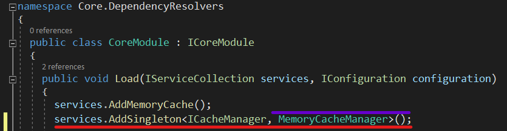
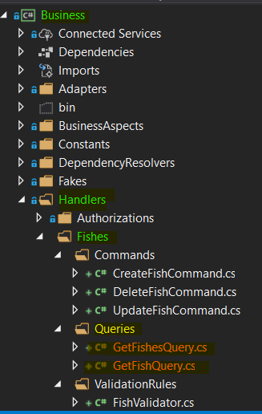
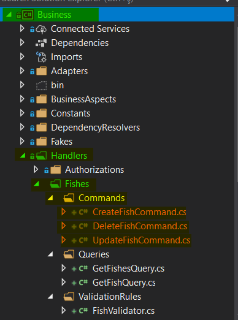

### Ön Bilgi
**DevArchitecture**  **Microsoft Memory Cache** ve **Redis Cache** desteğiyle gelir. Ön tanımlı olarak herhangi bir kurulum gerektirmemesi sebebiyle **Microsoft Memory Cache** tanımlı olarak gelir.

Kullanınım değişikliğin sağlamak için **Core Katmanında Core -> DependencyResolvers -> CoreModule.cs** sınıfı içerisinden 

**using Core.CrossCuttingConcerns.Caching.Microsoft;** eklenerek

**services.AddSingleton<ICacheManager, MemoryCacheManager>();**

ya da 

**using Core.CrossCuttingConcerns.Caching.Redis;** eklenerek

**services.AddSingleton<ICacheManager, RedisCacheManager>();** tanımıyla kullanılır.

**CacheAspect** ve **CacheRemoveAspcect** Attibuteleri için gerekli kütüphane ***Core Katmanı*** altından gelmektedir. 
Referans kütüphanesi için aşağıdaki satır usingler arasına eklenir.

**using Core.Aspects.Autofac.Caching;**

### Cache Aspect Kullanımı
**CacheAspect**'ler **Business -> Handlers -> <SınıfAdi> -> Queries** klasörü altında bulunan **Query** sınıfları içinde **Handle** metotları üzerinde **Attribute** olarak kullanılır.

 Özellikle dönüş tipi ***IEnumerable*** ve alt tipleri (**List, Array vb.**) için kullanılması tavsiye edilir. 
 Kullanımı aşağıdaki görsel üzerinde gösterilmiştir.

**CacheAspect** attribute içine parametre olarak **duration** isminde **int** bir değer alır. Bu değer ön tanımlı olarak 60 dakikadır. Üzerinde kullanıldığı metotun önem derecesine ve mimari tasarımın gerekliliklerine göre süre artıralabilir veya azaltılabilir.

### Cache Remove Aspect Kullanımı

**CacheRemoveAspect**'ler **Business -> Handlers -> <SınıfAdi> -> Commands** klasörü altında bulunan **Command** sınıfları içinde **Handle** metotları üzerinde **Attribute** olarak kullanılır.

Bu metot içine **string** olarak ilgili sınıfın **"Get"** metodunlarını tarayacağını belirten bir **pattern** alır. Bu metotların cache üzerinde işaretli değerlerini bulur, siler ve tekrar cache mekanizmasına ekler. Böylelikle yeni eklenen, güncellenen ve silinen kayıtlara uygun bir şekilde tekrar cache yapılmış olur.

**author:** Kerem VARIŞ