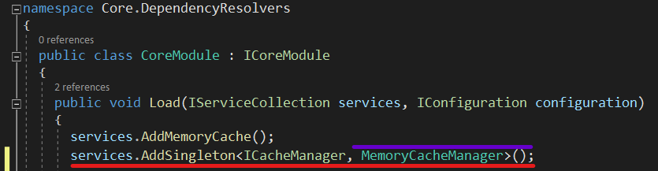
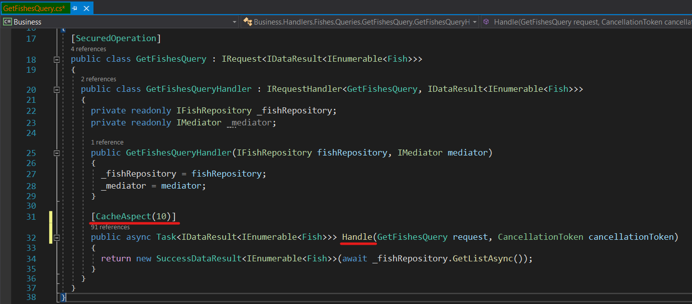
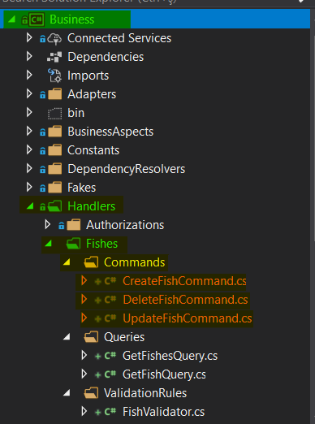
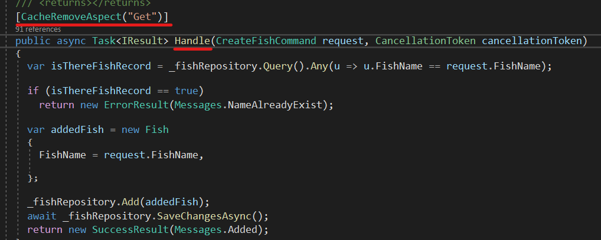

### Preliminary information

**DevArchitecture** comes with support for **Microsoft Memory Cache** and **Redis Cache**. It comes pre-defined with **Microsoft Memory Cache** as it does not require any installation.

To change its usage, go to **Core -> Dependency Resolvers -> Core Module.cs** class in Core Layer.

Add **using Core.CrossCuttingConcerns.Caching.Microsoft;**

**services.AddSingleton<ICacheManager, MemoryCacheManager>();**

Or 

Add **using Core.CrossCuttingConcerns.Caching.Redis;**

**services.AddSingleton<ICacheManager, RedisCacheManager>();**

The library required for **CacheAspect** and **CacheRemoveAspcect** Attributes comes from the **Core Layer**.
For the reference library, the following line is added between the usings.

**using Core.Aspects.Autofac.Caching;**

### Using Cache Aspect

**Cache Aspects** are used as **Attributes** on **Handle** methods in **Query** classes located under **Business -> Handlers -> 'ClassName' -> Queries** folder.

 It is especially recommended to use for return type ***IEnumerable*** and its subtypes
 (**List, Array etc.**). Its use is shown on the image below.

It takes an **int** value named **duration** as a parameter in the **CacheAspect** attribute. This value is 60 minutes by default.
The duration can be increased or decreased according to the importance of the method on which it is used and the
requirements of the architectural design.

### Using Cache Remove Aspect

**CacheRemoveAspects** are used as **Attributes** on **Handle** methods in **Command** classes located under
**Business -> Handlers -> 'ClassName' -> Commands** folder.

This method takes a **pattern** as a **string** indicating that it will scan the **"Get"** methods of the relevant class.
It finds the marked values of these methods on the cache, deletes them and adds them back to the cache mechanism.
In this way, the newly added, updated and deleted records are cached again.

**authors:** Kerem VARIŞ, Veli GÖRGÜLÜ