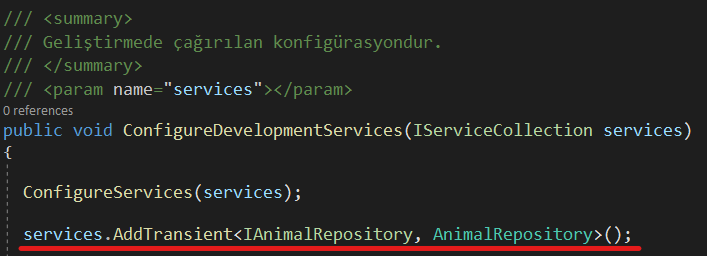
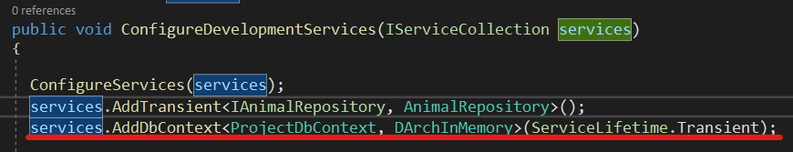
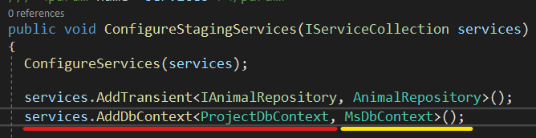
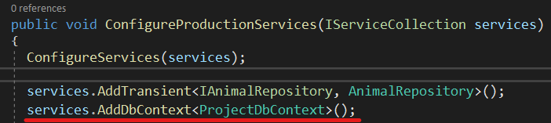

## Business Layer
### Startup Class

**Register** operation required for **Autofac** to **Business->Startup.cs** class is configured here.
This is also where the **Development, Staging, Production** environment variables are managed.
(***For details of environment variables, see*** [***Running Web Api Project***](runprojectwebapi)) Configuration for all
environment variables is defined by **DevArchitecture Code Generator**.

 

This class is also used to determine which database the system will work with.

### ConfigureDevelopmentServices Method

By default, the **ConfigureDevelopmentServices** method is configured to work with **InMemoryDb**. No changes are required.

### ConfigureStagingServices Method
By default, the **ConfigureProductionServices** method is configured to work with PostgreSql.
[Download PostgreSql](https://www.postgresql.org/download/)

If **MsSql** is desired to be used, it is used as follows.
[Download MsSql](https://www.microsoft.com/en-us/sql-server/sql-server-downloads)

### ConfigureProductionServices Method
By default, the **ConfigureProductionServices** method is configured to work with **PostgreSql**.
[Download PostgreSql](https://www.postgresql.org/download/)

If **MsSql** is desired to be used, it is used as follows.
[Download MsSql](https://www.microsoft.com/en-us/sql-server/sql-server-downloads)

**authors:** Kerem VARIŞ, Veli GÖRGÜLÜ