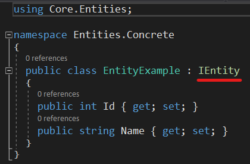
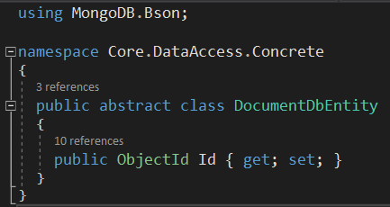
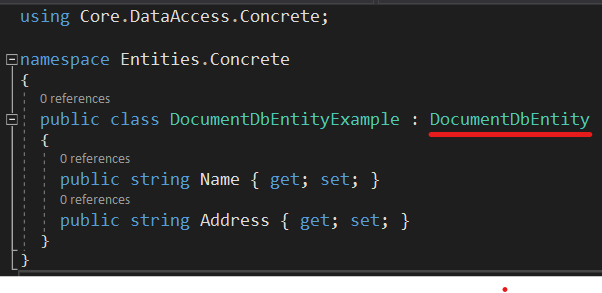
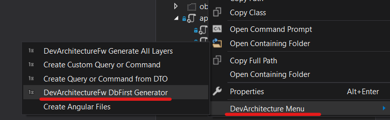
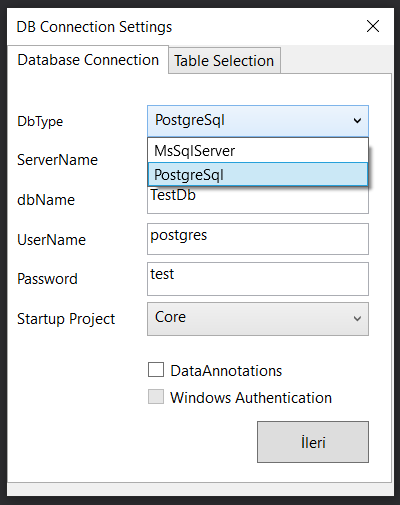
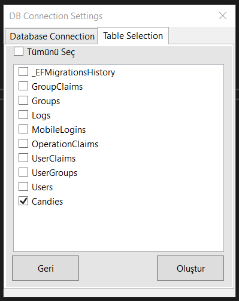
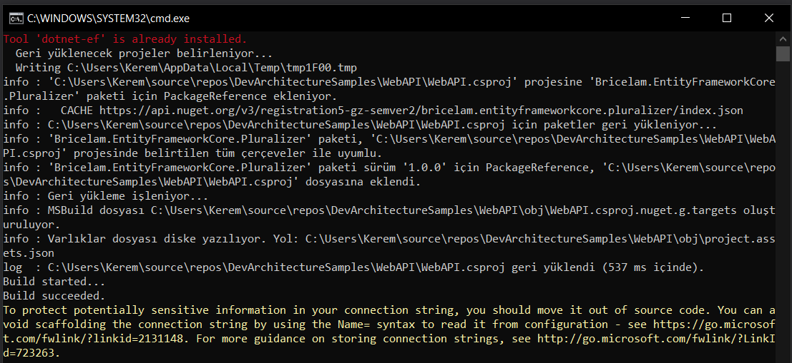
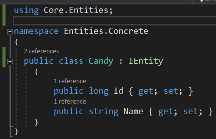
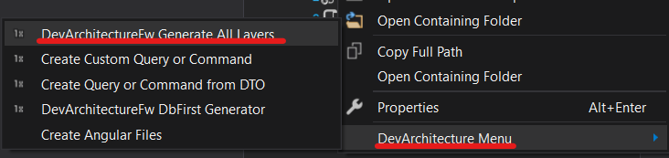
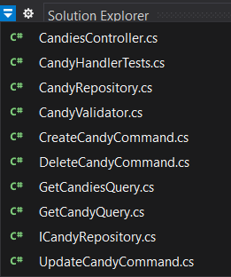

## Code First

You can work with two options in the *Code First* approach

1.  *Relational database*

2.  *Document-oriented database*

### Relational database

If a relational database (*RDBMS*) entity object is to be created in the *Code First* approach,
it should be created under the **Concrete** folder in the **Entities** layer.

When a relational database will be used, the created class is expected to be implemented from the **IEntity**
Interface. DevArchitecture Code Generator will understand that you want to work with a relational
database and accordingly the code generator will generate the relevant methods and classes. Example
class writing for relational database is presented as follows.

### Document-Oriented Database (NoSQL)

If a document-oriented database entity object is to be created in the Code First approach, it should
be created under the **Concrete** folder in the **Entities** layer.

When using a document-oriented database, the created class is expected to inherit
from the **DocumentDbEntity** abstract class. **DevArchitecture Code Generator** will understand
that you want to work with a document-oriented database and accordingly the code generator
will generate the relevant methods and classes.

It is not recommended to write a property representing the **Primary Key** used
in relational databases in these classes. Within the **DocumentDbEntity** abstract class,
the **ObjectId key** for **MongoDB** is inherited.

Example class writing for **MongoDB** is presented as follows.

## Database First

**DevArchitecture Code Generator** is used for the **Database First** approach.

On the screen that opens, the database to be connected and the connection information
are defined. It comes with **Database First** support for **DevArchitecture MsSqlServer**
and **PostgreSql**. After selecting the connection information and **Startup Project**
as **WebAPI**, the next button is pressed. Tables for which Database classes will
be created are selected in the **Table Selection** tab. After that, click the Create button.

The Command Line screen below will automatically close. Database class is created under **Entities\\Conctere**
Folder and **FakeDbContext** class is created under **DataAccess\\Concrete\\EntityFramework\\Contexts** folder.
The **FakeDbContext** class is created temporarily for **OnModelCreating** only. If necessary, the relations formed
here can be used by creating separate classes with the copy and paste method under **DataAccess\\Concrete\\Configurations**.

The database class resulting from this process should be as follows.

Right click on this class again. Click on **DevArchitecture Generate All Layers**.

Related methods and classes are created for all layers. In addition,
all necessary configuration such as Autofac DI Registration operations,
**DbSet** definitions for **DbContext** are defined by **DevArchitecture Code Generator**
within the required classes and methods.

**authors:** Kerem VARIŞ, Veli GÖRGÜLÜ