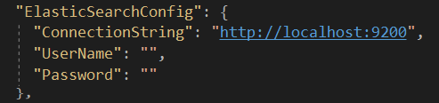

**DevArchitecture** comes with **ElasticSearch** support. It uses **Nest** library for **ElasticSearch** support.
You can use ***https://github.com/elastic/elasticsearch-net*** for Nest library.

Classes related to **ElasticSearch** are located in the **ElasticSearch** folder under **Utilities** in the **Core** layer.

To connect to the **ElasticSearch** server, the fields in the **ElasticSearchConfig**
module in the **appsettings.json** file must be filled.

**ElasticSearch** operation operations are defined in the **IElasticSearch** interface. **ElasticSearchManager**
class is used as base. **DevArchitecture** supports the operations of indexing, adding data, adding
multiple data, updating data, deleting data, listing data, listing data by field name and listing
data by query on **ElasticSearch**.

**DevArchitecture ElasticSearch** operations

***Not***: **ElasticSearch**' de Insert işleminde ilgili
index'in oluşturulup oluşturulmadığı kontrol edilmelidir.
***GetIndexList()*** metodu ile mevcut Indexlerin listesine
erişilir. Eğer index yok ise ***CreateNewIndexAsync()*** metodu
kullanılarak index oluşturulabilinir.

***Note***: In **ElasticSearch**, it should be checked whether the relevant index is created in the Insert operation.
With the ***GetIndexList()*** method, the list of available Indexes is accessed. If there is no index, the index
can be created using the ***CreateNewIndexAsync()*** method.

**Note: Index names must be lowercase**

**ElasticSearch** operations use their own ("**/_id**") field for **ElasticSearch** operations.
This field is the **Nest.Id** field in the **Nest** library. This field is defined in **DevArchitecture**
in the **ElasticSearchModel** class. **ElasticSearchInsertManyModel**, **ElasticSearchInsertUpdateModel**,
which are used for other *CRUD* operations, use **ElasticSearchModel** class as base class. In addition,
the **IndexName** field used in each *CRUD* operation is also defined in this base class.

**ElasticSearchGetModel** class is used as a response model in **Get** operations made over **ElasticSearch**.
This model has the generic type property. By default, it returns the value of **ElasticSearch** ("**/_id**")
and the object of the class type defined in the generic type.

Example **ElasticSearch** *Get* method

Example **ElasticSearch** Response.

**authors:** Kerem VARIŞ, Veli GÖRGÜLÜ