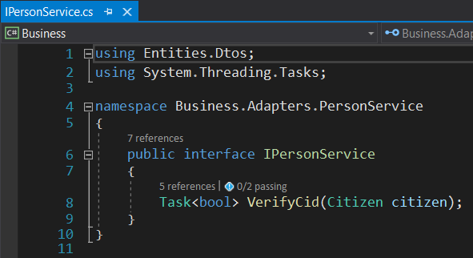

### WebService Entegrasyonu
Webservice entegrasyonu örnek uygulaması için https://tckimlik.nvi.gov.tr/Service/KPSPublic.asmx servisi kullanılmıştır. Bu servisin beklediği bilgiler aşağıda bulunan şekilde işaretlenmiştir. 

**Connected Services** eklendikten sonra dış servislerle iletişim noktası olarak **Business -> Adapters** klasörü kullanılır. 

Belirli bir düzen sağlamak için **Adapters** klasörü altında **PersonService** isminde bir klasör oluşturulur. Bu servisi temsil eden bir **IPersonService** Interface'i ve ***VerifyCid*** isminde dış servisin beklediği propertyleri temsil eden bir metot ile ilk giriş noktası oluşturulur. 

**IPersonService** Interface'inin implementasyonu aşağıdaki şekilde gösterilmiştir.

Bu şekilde dış bir servis **DevArchitecture** mimari yapısına uygun çalışır ve metotlar tarafından erişilebilir hale getirilir.

### RESTful API Service Entegrasyonu

**DevArchitecture** ile RESTful API Service entegrasyonu için **Refit** kütüphanesi kullanılır.

