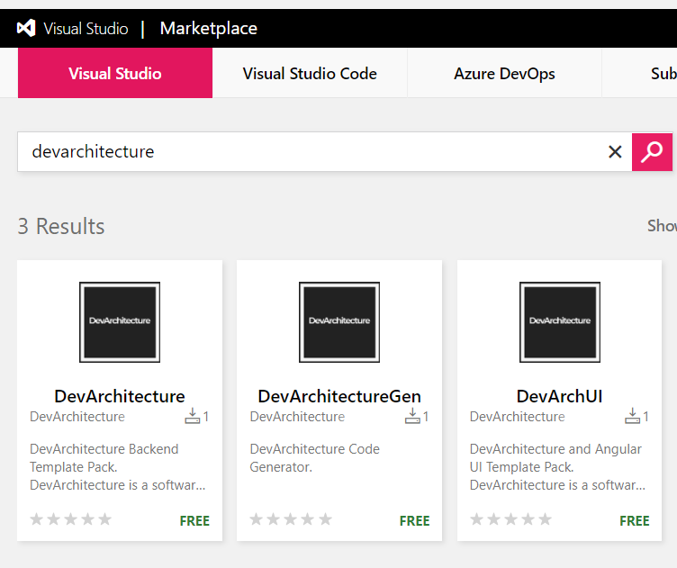
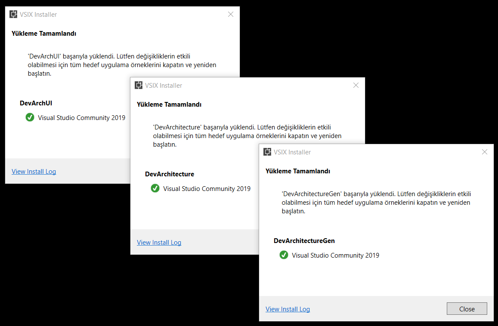

Download and install **Visual Studio 2019 Extension** packages for **DevArchitecture** from
[marketplace.visualstudio.com](https://marketplace.visualstudio.com/search?term=devarchitecture&target=VS&category=All%20categories&vsVersion=&sortBy=Relevance)
There are 3 extensions on the Marketplace.

### NOTE: 
***Make sure that your Visual Studio Development environment is closed while these installations are being made.***

1.  *DevArchitecture WebAPI Template*

2.  *DevArchitecture WebAPI and Angular Template*

3.  *DevArchitecture Code Generator*

The desired templates **1** and **2** or both can be downloaded. *Code Generator* is recommended to be downloaded and used by the **DevArchitecture** team.

**authors:** Kerem VARIŞ, Veli GÖRGÜLÜ

