## WebService Integration
### WebService Example
For the Webservice integration sample application, https://tckimlik.nvi.gov.tr/Service/KPSPublic.asmx service was used.
The information that this service expects is marked as below.

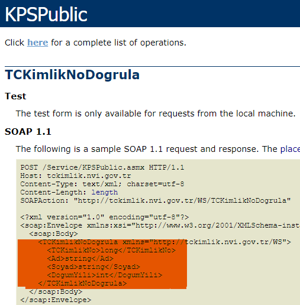

### Usage
After adding **Connected Services**, **Business -> Adapters** folder is used as communication point with external services.

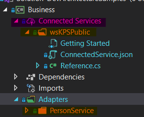

### Implementation
A folder named **PersonService** is created under the **Adapters** folder to maintain a certain order.
The first entry point is created with an **IPersonService** Interface representing this service and a method named
***VerifyCid*** that represents the properties that the external service expects.

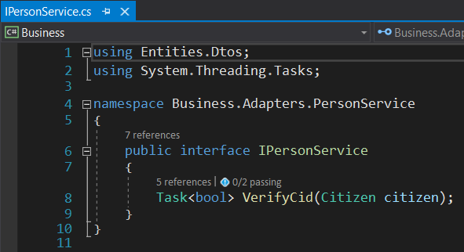

The implementation of the **IPersonService** Interface is shown in the figure below.

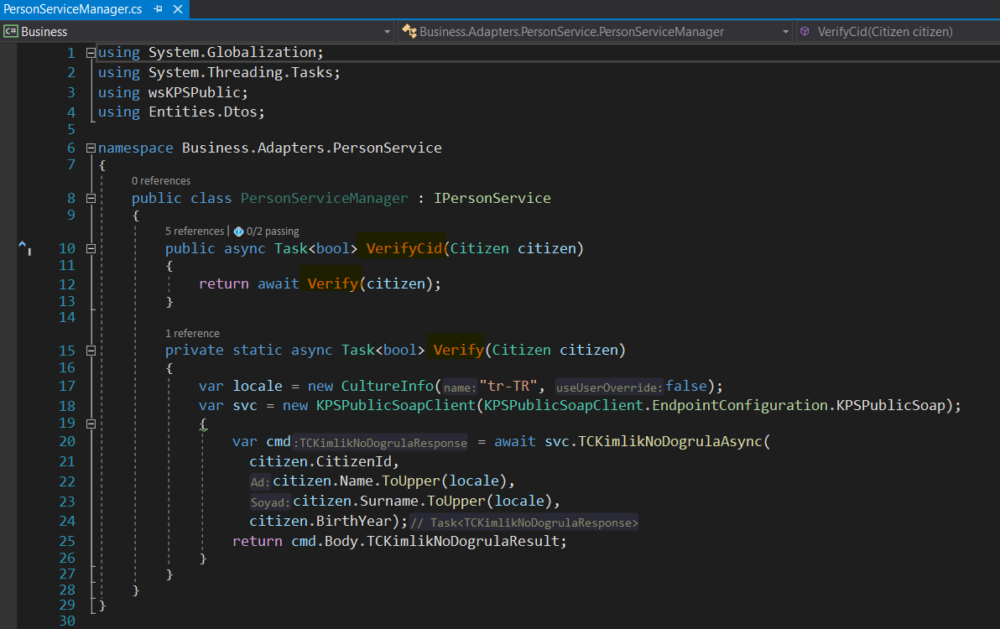

### Result
In this way, an external service works in accordance with the **DevArchitecture** architecture and is made accessible by methods.

## RESTful API Service Integration
### Refit Installation
This example uses https://jsonplaceholder.typicode.com/todos open api for RESTful API Service.

**Refit** library is used for **DevArchitecture** RESTful API Service integration.

[(https://www.nuget.org/packages/Refit/)](https://www.nuget.org/packages/Refit/)

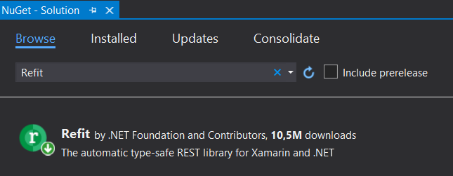

### RESTful API Service Example
The structure of the api model is examined by fetching a single record via https://jsonplaceholder.typicode.com/todos/1.

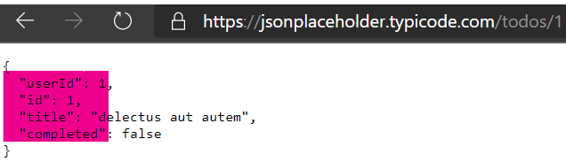

### Creating a DTO
According to this model, a ***DTO*** (Data Transfer Object) class named **TodoDto.cs** is created in **Entities -> Dtos**.

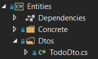

This class is Implemented using the ***IDto*** Interface.

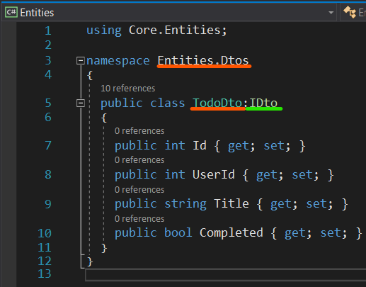

### RESTful Service Implementation
**Business -> Adapters** folder is used to include external services in **DevArchitecture** architecture.
A folder named **TodoService**, which represents the name of the service that will be used under this folder, is created.

Due to its structure, **Refit** makes it possible to communicate with an Interface.
An interface and a class named **TodoServiceManager** are created for **ITodoDataService** and its implementation.

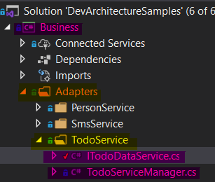

Because **ITodoDataService** calls a Get method, it uses the **Get** method of the **Refit** library.
It takes the url parameters that come after the main url part of the api url address,
together with the **/** sign. example: https://jsonplaceholder.typicode.com **/todos**

This interface is used by inheriting the **TodoServiceManager** class to be implemented.
The usage for this example is as follows. (For **Refit** usage, see https://github.com/reactiveui/refit.)

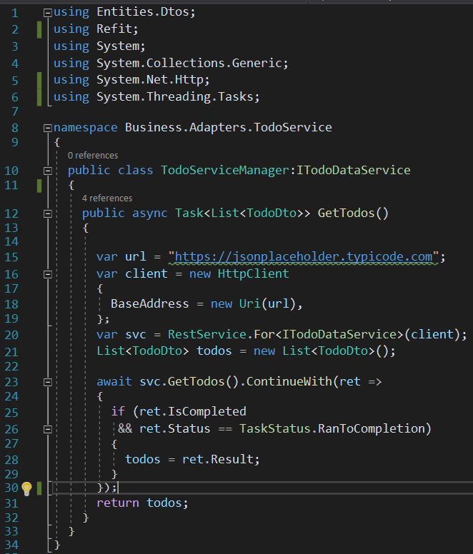

### Creating and Calling the Handler Class
A List Query template is created to create a folder named **TodoDto** **Todos**
under the **Business -> Handlers ->** folder and a folder named ***Query*** under it.

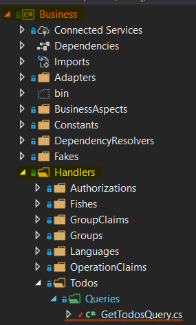

A Query Class named **GetTodosQuery** is created under this folder. The **GetTodosQuery** class is arranged as follows.

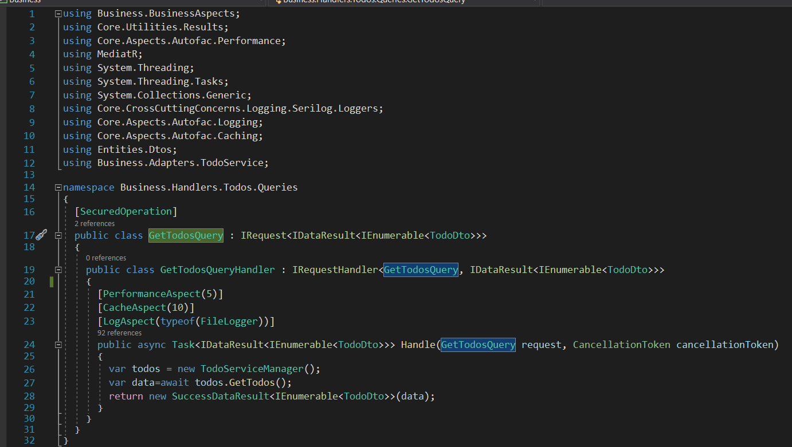

A new instance of the **TodoServiceManager** class is defined under the **GetTodosQuery** class **Handle** method.

**var todos = new TodoServiceManager();** 

The ***GetTodos()*** method is called.

**var data=await todos.GetTodos();**

The **data** variable is set as the return value.

**return new SuccessDataResult<IEnumerable<TodoDto\>\>(data);**

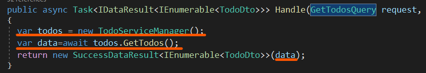

### Creating Controller

A new **TodosController** is created under **WebAPI -> Controllers**.

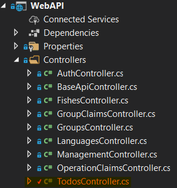

The **TodosController** is arranged as follows. It is marked with [[AllowAnonymous]], so that continuous authorization problems are prevented during user testing phases.

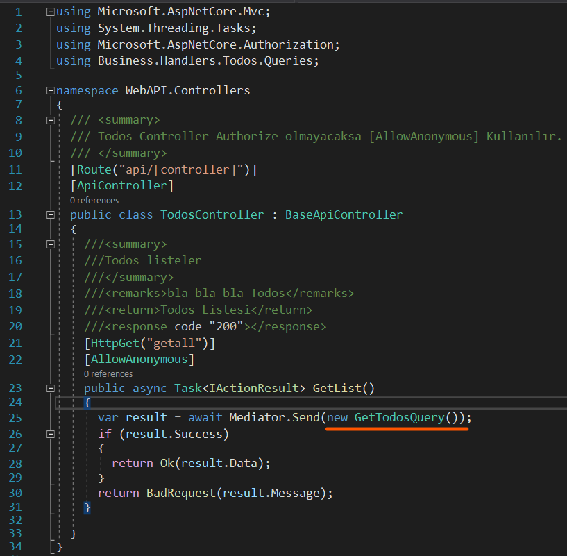

### Running the Project
The project is run by selecting the **IIS_Development** environment variable.

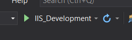

### Result

As a result, the **getall** method is executed on the **Swagger** screen and all results are called via an external **RESTful API Service**.

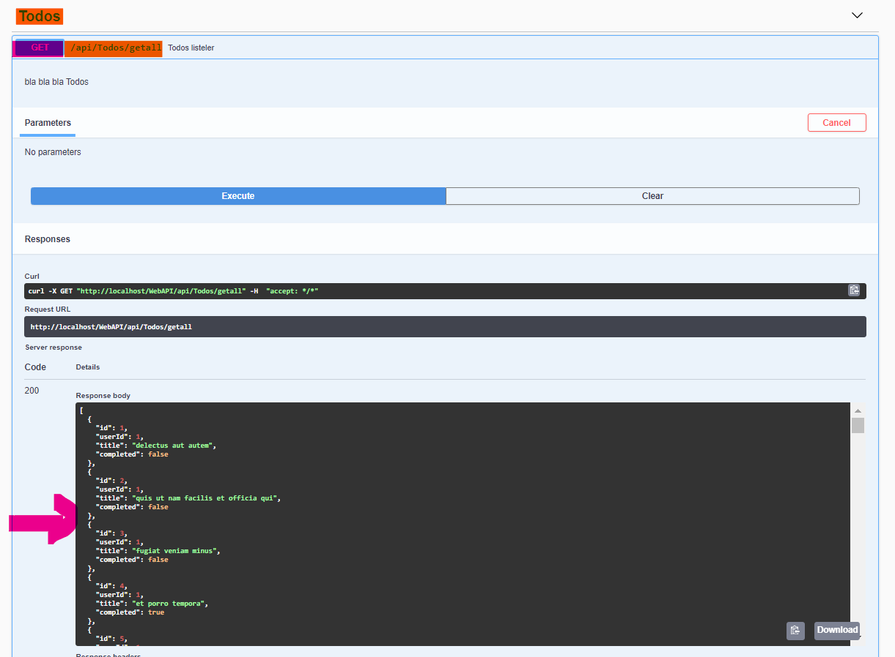

**authors:** Kerem VARIŞ, Veli GÖRGÜLÜ