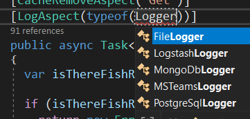
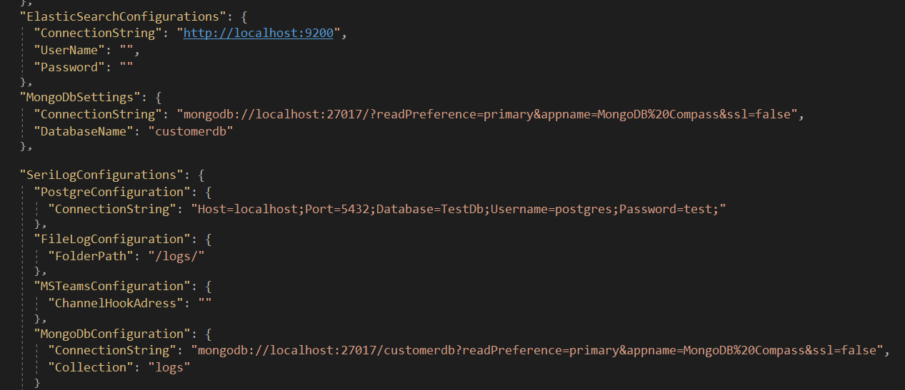

**LogAspects** are used as **Attributes** on **Handle** methods in **Business -> Handlers -> 'ClassName'** Command and Query classes. Usage is as follows.

**LogAspect** with **DevArchitecture**;

It comes with support for
1. **FileLogger**
2. **PostgreSqlLogger**
3. **MongoDbLogger**
4. **LogstashLogger**
5. **MSTeamsLogger**

By default, **FileLogger** is used.

Log configuration to be used is done in **WebAPI -> appsettings.json**.

**authors:** Kerem VARIŞ, Veli GÖRGÜLÜ