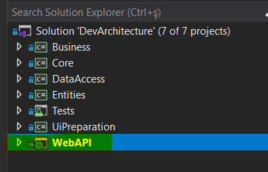
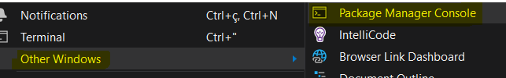
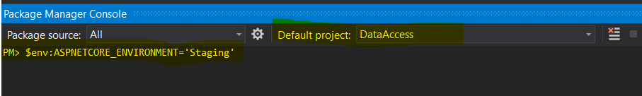

export const Highlight = ({children, color}) => ( {children} );

An environment variable must be selected for the project before a migration can be created.
Environment variable selection is done using the following command sets. 
(***For details of environment variables and Connection String management, see.*** [***Running the Web API Project***](runprojectwebapi))

(***For Database Selection and Configuration, see. *** [***Database Selection and Configuration***](databaseselection))

There are two types of environment variables for **Migration Management** with **DevArchitecture**;

-   **Staging**

-   **Production**

If migration will be made for the environment variables mentioned above,
the following command examples are run after the selection is made.

**$env:ASPNETCORE_ENVIRONMENT=<Highlight color="#FF0000">'Staging'</Highlight>**

**$env:ASPNETCORE_ENVIRONMENT=<Highlight color="#FF0000">'Production'</Highlight>**

## PostgreSql

To run migration on *PostgreSql*, run the following commands respectively.

### Migration via IDE

If migration will be done via IDE, for example to *Staging*;

1. If the *WebAPI* project is not defined, it is defined as **Set as Startup Project** by right-clicking on the project.

2. The **Package Manager Console** screen opens from the *Visual Studio 2019* **View** -> **Other Windows** menu.

3. The *Default Project* **DataAccess** project is selected and the commands below are run on this screen.

 

**$env:ASPNETCORE_ENVIRONMENT=<Highlight color="#2962FF">'Staging'</Highlight>**

**Add-Migration <Highlight color="#FF0000">InitialCreate</Highlight> -Context ProjectDbContext -OutputDir
Migrations/Pg**

**$env:ASPNETCORE_ENVIRONMENT=<Highlight color="#2962FF">'Staging'</Highlight>**

**Update-Database -context ProjectDbContext**

### Alternatively, migration via command line

**dotnet ef migrations add <Highlight color="#FF0000">InitialCreate</Highlight> \--context ProjectDbContext
\--output-dir Migrations/Pg**

## MsSql

To run migration on *Microsoft Sql Server*, run the following commands respectively.

### Migration via IDE

If migration will be done via IDE, for example to *Staging*;

1. If the *WebAPI* project is not defined, it is defined as **Set as Startup Project** by right-clicking on the project.

2. The **Package Manager Console** screen opens from the *Visual Studio 2019* **View** -> **Other Windows** menu.

3. The *Default Project* **DataAccess** project is selected and the commands below are run on this screen.

 

**$env:ASPNETCORE_ENVIRONMENT=<Highlight color="#2962FF">'Staging'</Highlight>**

**Add-Migration <Highlight color="#FF0000">InitialCreate</Highlight> -context MsDbContext -OutputDir
Migrations/Ms**

**$env:ASPNETCORE_ENVIRONMENT=<Highlight color="#2962FF">'Staging'</Highlight>**

**Update-Database -context MsDbContext**

### Alternatively, migration via command line

**dotnet ef migrations add <Highlight color="#FF0000">InitialCreate</Highlight> \--context MsDbContext
\--output-dir Migrations/Ms**

## Oracle

To run migration on *Oracle*, run the following commands respectively.

### Migration via IDE

If migration will be done via IDE, for example to *Staging*;

1. If the *WebAPI* project is not defined, it is defined as **Set as Startup Project** by right-clicking on the project.

2. The **Package Manager Console** screen opens from the *Visual Studio 2019* **View** -> **Other Windows** menu.

3. The *Default Project* **DataAccess** project is selected and the commands below are run on this screen.

 

**$env:ASPNETCORE_ENVIRONMENT=<Highlight color="#2962FF">'Staging'</Highlight>**

**Add-Migration <Highlight color="#FF0000">InitialCreate</Highlight> -context OracleDbContext -OutputDir
Migrations/Ora**

**$env:ASPNETCORE_ENVIRONMENT=<Highlight color="#2962FF">'Staging'</Highlight>**

**Update-Database -context MsDbContext**

### Alternatively, migration via command line

**dotnet ef migrations add <Highlight color="#FF0000">InitialCreate</Highlight> \--context OracleDbContext
\--output-dir Migrations/Ora**

### Not:

**Command fields marked with <Highlight color="#FF0000">Red</Highlight> are the fields that are expected to be changed at each use.**

**The areas marked in <Highlight color="#2962FF">Blue</Highlight> are the areas where optional changes are expected.**

**authors:** Kerem VARIŞ, Veli GÖRGÜLÜ
