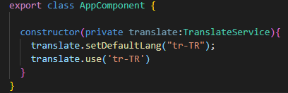
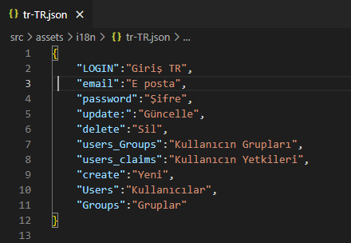

## Api Katmanı

**DevArchitecture** Çoklu Dil Desteğini (**MultiLanguage**) çekirdeğinde barındıran bir mimaridir. **Core -> Entities -> Concrete**
katmanında bulunan **Language** ve **Translate** modelleri çoklu dil çevirisi ve kullanımının alt yapısını oluşturur.

İlk ***migration*** işlemi ile veri tabanında oluşturulan **Languages**
tablosuna, **İngilizce(en-US)** ve **Türkçe(tr-Tr)** dilleri, dil kodları ile birlikte otomatik olarak
eklenmektedir. Ayrıca bazı temel kelime çevirileri de **Translates** tablosuna eklenmektedir.

***Languages Tablosu***

***Translate Tablosu***

**Not: Yukarıda ki ekran görüntüsünde görüldüğü üzere** ***Code*** 
**alanına girilen dil kodları genel geçer (*Web Tarayıcıları ve işletim sistemleri*) kullanımda olan dil kodlarıyla aynı olmak zorundadır. AngularUI kısmında gerekli eşleştirmeleri yapmak için dil kodları önemlidir.**

Dil ile ilgili **CRUD** operasyonları **LanguagesController**, çeviri ile ilgili
CRUD operasyonları ise **TranslatesController** üzerinden gerçekleştirilir.

Bir dile ait çeviriler **TranslatesController** üzerinde bulunan
**gettranslatesbylang** ***GET*** metodu ile elde edilir. Bu metod parametre
olarak dil kodu almaktadır(en-US, tr-TR vb.). **Cevap** (Response) olarak **Key**, **Value**
değerinde **Json** nesnesi dönmektedir.

Örnek request : **/WebAPI/api/Translates/gettranslatesbylang?lang=en-US**

## AngularUI

AngularUI tarafında dil işlemleri için **ng-translate** kütüphanesi
kullanılmaktadır. **AngularUI** kısmında varsayılan dil olarak **Türkçe (tr-TR)**
atanmıştır. Varsayılan dil **AppComponent** üzerinden değiştirilir.

Ng-translate kütüphanesine iki farklı şekilde kaynak olarak
verilmektedir. Bu kütüphaneyi detaylı incelemek için ***https://github.com/ngx-translate/core*** adresini kullanabilirsiniz.

1. **Static** olarak tanımlanan **Json** dosyalarıdır. Burada her bir dil
için **Json** dosyaları oluşturulur ve değerler **Key**,**Value** formatında
yazılır. **DevArchitecture**, **AngularUI** da **src/assets/i18n** dosya yolu altında
**Json** dosyaları bulunmaktadır. Kullanılmak istenilen her bir yeni dil
için **i18n** klasörünün altına **Json** dosyası oluşturmak gerekmektedir.

Dil Çevirilerinde Kullanılan **Json** Dosyaları

Örnek **Json** Formatı

2. Dil çevirilerinin **API** üzerinden **Request/Response** olarak
alınmasıdır. **DevArchitecture**, **AngularUI** dil çevirilerini bu yöntem ile
yapmaktadır. **API** ile iletişim **TranslationService** isimli bir sınıf
üzerinden gerçekleştirilmektedir.

**AngularUI** projesi ilk ayağa kalktığı zaman varsayılan dil **Türkçe** olduğu için **API**
den **Türkçe** çevirileri getirmektedir. (**api/Translates/gettranslatesbylang?lang=tr-TR**) **Login** ekranında başka bir dil seçilmesi durumunda **API** den o dile ait çeviriler getirilir ve **Logout** oluncaya kadar seçilen dil ile ilgili çeviriler ekranda görülür.

**author:** Kerem VARIŞ
