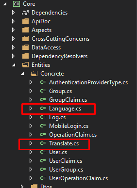
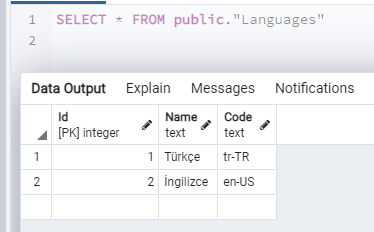
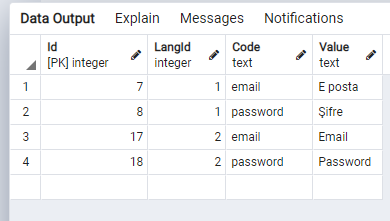
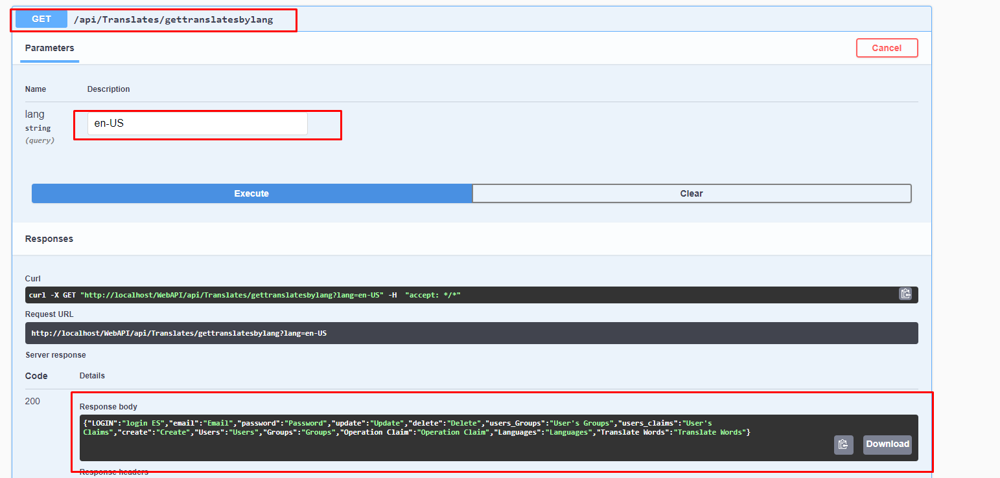
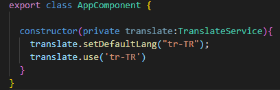
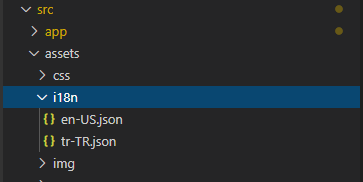
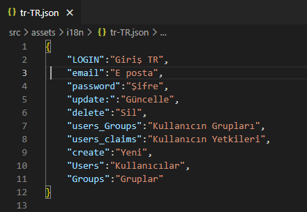

## Api Layer

**DevArchitecture** is an architecture that includes **Multi-Language** at its core. 
**Language** and **Translate** models in the **Core -> Entities -> Concrete** layer
form the infrastructure of multi-language translation and usage.

**English(en-US)** and **Turkish(tr-Tr)** languages are automatically added together with their language codes to the
**Languages** table created in the database with the first **migration** process. Also, some basic word translations
are added to the **Translates** table.

***Languages Table***

***Translate Table***

**Note: As can be seen in the screenshot above, the language codes entered in the Code field must be the same as the language codes in use**
**(*Web Browsers and operating systems*). Language codes are important to make the necessary mappings in AngularUI.**

Language-related **CRUD** operations are performed via the **LanguagesController**,
and translation-related CRUD operations are performed via the **TranslatesController**.

Translations of a language are obtained with the **gettranslatesbylang** ***GET*** method on the **TranslatesController**.
This method takes a language code as a parameter (en-US, en-TR, etc.). Returns **json** object containing (**Key**,**Value**) as **response**.

Example request : **/WebAPI/api/Translates/gettranslatesbylang?lang=en-US**

## AngularUI

**AngularUI** uses **ng-translate** library for language operations. **Turkish (tr-TR)** is assigned
as the default language in **AngularUI**. The default language is changed via **AppComponent**.

Data are exported to the ng-translate library in two different ways.
You can use ***https://github.com/ngx-translate/core*** to review this library in detail.

1. They are **Json** files defined as **static**. Here, **Json** files are created for each language and
values are written in (**Key**,**Value**) format. In **DevArchitecture**, **AngularUI**, there are **Json**
files under the **src/assets/i18n** file path. For each new language to be used, it is necessary
to create a **Json** file under the **i18n** folder.

**Json** Files Used in Language Translations

Example **Json** Format

2. Language translations are received via **API** as **Request/Response**.
**DevArchitecture** makes **AngularUI** language translations with this method.
Communication with the **API** is done through a class called **TranslationService**.

When the **AngularUI** project runs for the first time, the default language is **Turkish**,
so it brings **Turkish** translations from the **API**. (**api/Translates/gettranslatesbylang?lang=tr-TR**)
If another language is selected on the **login** screen, translations of that language are retrieved
from the **API** and the translations related to the selected language are displayed on the screen until **Logout**.

**authors:** Kerem VARIŞ, Veli GÖRGÜLÜ
