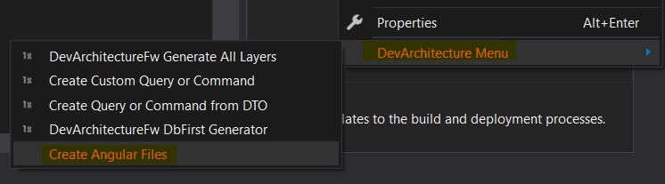
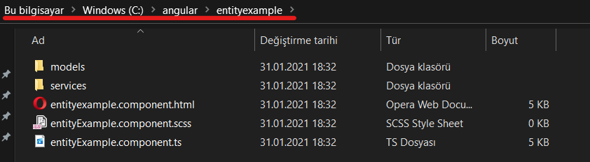
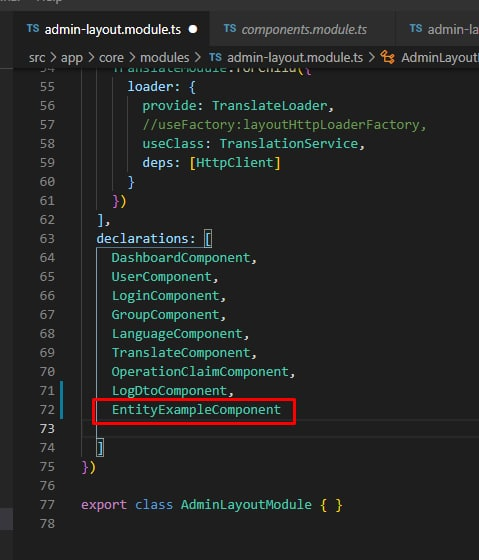
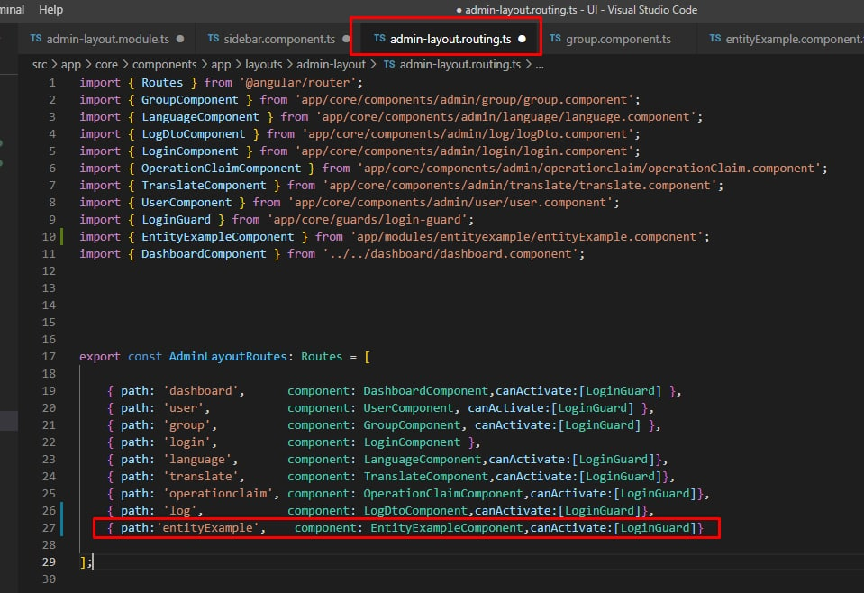
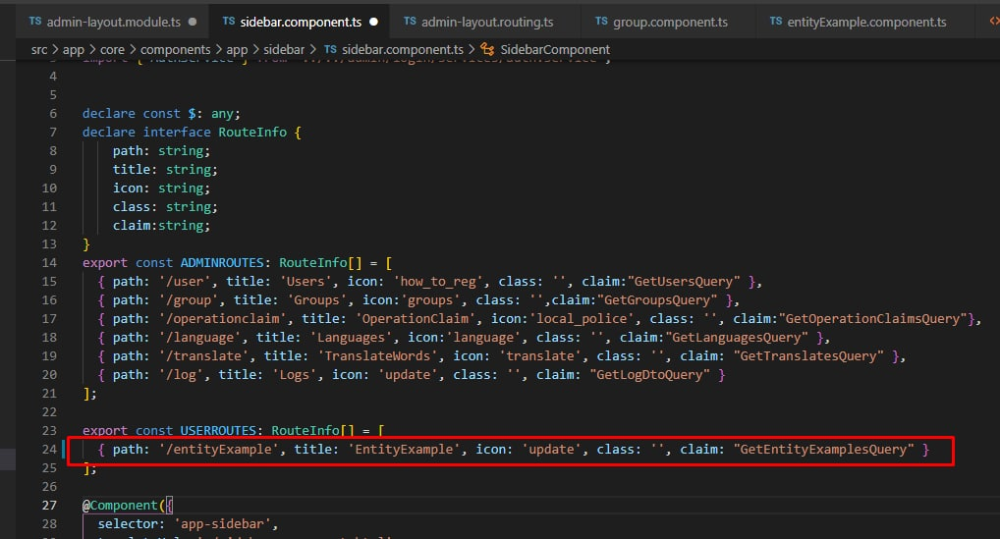

Right-click on the relevant class for a module that was previously prepared to
present data from the **DevArchitecture** WebAPI layer. From the menu that opens,
click **DevArchitecture Menu** -> **Create Angular Files**, respectively.

In order to reduce the **DevArchitecture** dependency of Front-End support, it is set to create an ng component in a folder you want.

In order for the created *ng component* to work in the system, the necessary files must be added to the system in 3 stages after creating.

1. The **declarations** in ***admin-layout.module.ts*** are added to the *Component Class*.

2. It is added as a *path* to the **AdminLayoutRoutes** section in ***admin-layout.routing.ts***.
   

3. It is added as a path to the **USERROUTES** section in ***sidebar.components.ts***.
   

**authors:** Kerem VARIŞ, Veli GÖRGÜLÜ