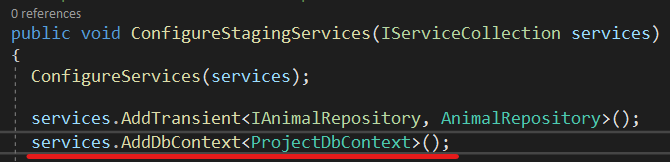
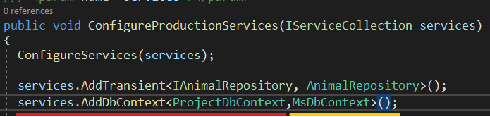

### Relational Database

If a relational database (*RDBMS*) entity object is to be created in the *Code First* approach,
it should be created under the **Concrete** folder in the **Entities** layer.

When a relational database will be used, the created class is expected to be implemented from the **IEntity** Interface.
***At the same time, it is a must that the created class name and the file name be the same***.

**DevArchitecture Code Generator** will understand that you want to work with a relational
database and accordingly the code generator will generate the relevant methods and classes.
Example class writing for relational database is presented as follows.

Right click on this created class and enter the **DevArchitecture Code Generator** Menu.

 

Click on **DevArchitectureFw Generate All Layers**.

 

Wait a few seconds for the required classes, methods and configurations to be created for all layers.

 

## DataAccess Layer

### ProjectDbContext Class

Defining **DbSet** into **DataAccess->Concrete->EntityFramework->Contexts->ProjectDbContext** is done automatically.

 

If there is a need for **Migration** at the end of this process, the **Migration** process is started. (See [***Migration Management***](migration))

## Business Layer
### Startup Class

Register operation required for **Autofac** to **Business->Startup.cs** class is configured here.
This is also where the **Development, Staging, Production** environment variables are managed.
Configuration for all environment variables is defined by **DevArchitecture Code Generator**.

 

This class is also used to determine which database the system will work with.

By default, the **ConfigureDevelopmentServices** method is configured to work with **InMemoryDb**.
No changes are required.

By default, the **ConfigureStagingServices** method is configured to work with **PostgreSql**.

If **MsSql** is desired to be used, it is used as follows.

By default, the **ConfigureProductionServices** method is configured to work with **PostgreSql**.

If **MsSql** is desired to be used, it is used as follows.

### Handler Folder

CQRS-based system methods and validation definitions are created here. All methods for the created class are accessed as follows. When a new method is needed, **DevArchitecture Code Generator** template methods are created by right-clicking on the class object under the relevant folder.

## WebAPI Layer

This layer is the first entry point for communication with the outside world.
All operations defined in the **Handlers** in the **Business** layer are automatically
defined here. Unless a new method is added to the **Controllers**, there is no special mechanism.

If you want to enrich the Api documentation, it will be useful for developers
who will use the Api to write the **Summarys** on the **Controllers**.

The newly created module is now ready to use when the screenshot below is accessed.

**authors:** Kerem VARIŞ, Veli GÖRGÜLÜ