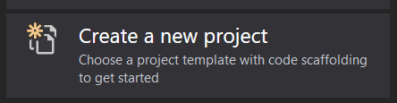
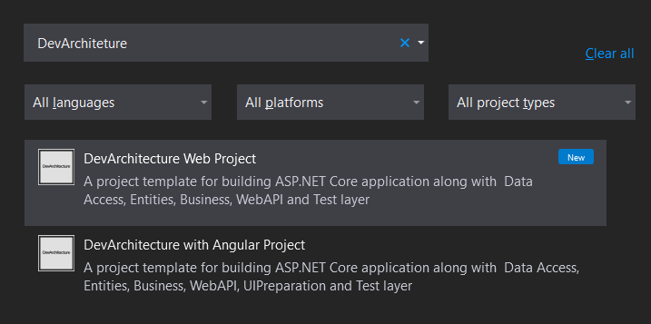
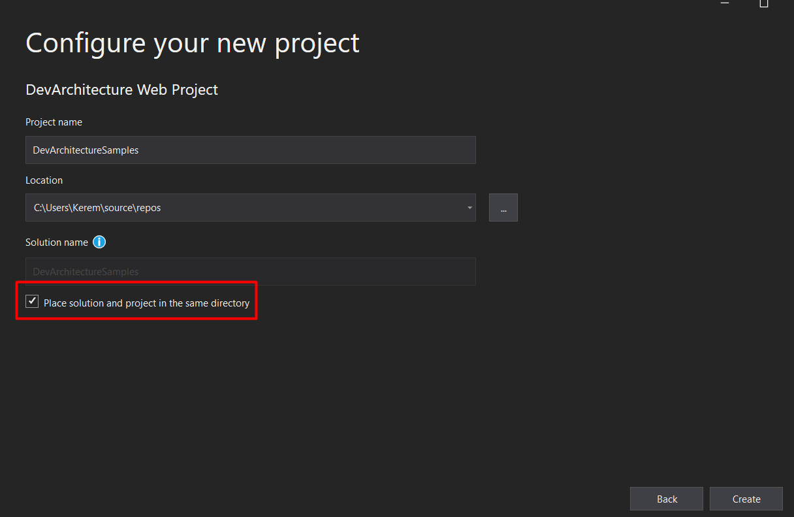
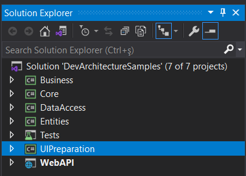

export const Highlight = ({children, color}) => ( {children} );

Open *Visual Studio 2019*. Click the **Create a new project** option.

On the screen that opens, **DevArchitecture** is written in the **Search** field and
the incoming **DevArchitecture Web Project** or **DevArchitecture with Angular Project project**
template is selected.

After selecting the project template, click the **Next** button.
The name to be given to the project and the location of the project
in the file system are determined on the next screen. Make sure that
the option ***<Highlight color="#FF0000">Place solution and
Project in the same directory</Highlight>***, marked
with a red frame, is checked. Afterwards, the project template is made
ready by clicking the **Create** button.

When you see the screenshot below, you can start coding your project without any problems.

Congratulations! you are now ready to become a **DevArchitecture** developer.

**authors:** Kerem VARIŞ, Veli GÖRGÜLÜ