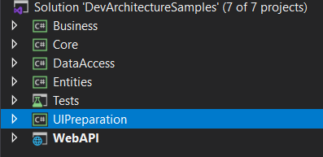
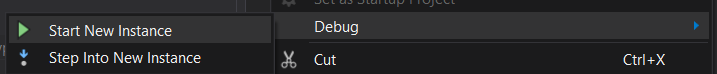
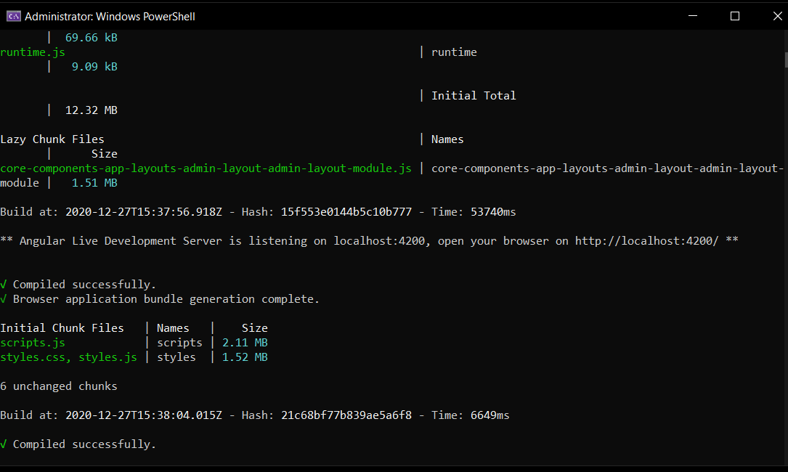

**WebAPI** projesi *Visual Studio* Geliştirme ortamında IDE üzerinden **Start** butonu yardmıyla ya da klavye üzerinden *F5* veya *CTRL + F5* tuşlarına basılarak çalıştırılır. (bkz. [***Web Api Projesini Çalıştırma***](projecalistirmawebapi))

**UIPreparation** projesi üzerinde sağ tıklanır.

Açılan menüde ***Debug*** menüsü altında ***Start New Instance*** seçeneğiyle ***WebAPI***
projesi durdurulmadan bu proje de çalıştırılır.

Bu proje ***Angular*** arayüzü için gerekli kurulumları yapacaktır. Sırasıyla:

-   **Nodejs** paketleri indirilecek

-   **VsCode** ortamı proje için açılacak

-   **ng serve --open** komutu çalıştırılacak proje varsayılan tarayıcı ile
    açılacaktır.

Giriş ekranı geldiğinde

**Kullanıcı Adı:** admin@adminmail.com

**Parola:** Q1w212\*\_\*

Bilgileri kullanılarak sisteme giriş yapılır.

**Tebrikler!** Artık bir **DevArchitecture** geliştiricisi olarak aramıza **Hoşgeldiniz!**