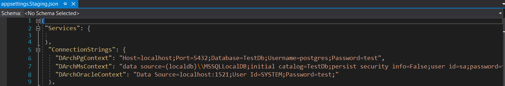

***WebAPI*** Projesini çalıştırmak için öncelikle ***Visual Studio 2019*** üzerinden
ortam değişkeni seçimi yapılmalıdır. Ekran üzerinde görülen ortam
değişkenlerinin yapısı alt başlıklarda açıklanmıştır.

Eğer bu konfigürasyonlar üzerinde değişiklik yapılmak istenirse **WebAPI** üzerinde sağ tıklanır. Açılan Menüden **Properties** menüsüne tıklanır. Açılan ekranda **Debug** tabından istenilen düzenleme yapılır.

## WebAPI

### IIS Express

Bu ortam değişkeni seçilerek proje başlatıldığında proje **InMemoryDb**
desteğiyle birlikte çalışır. Herhangi bir veri tabanı kurulumuna ihtiyaç
olmadan projenizi çalışır hale getirebilirsiniz. **IIS Express** ortam
değişkeni Visual Studio ile ön tanımlı olarak gelmektedir.

### IIS_Development

Bu ortam değişkeni seçilerek proje başlatıldığında proje **InMemoryDb**
desteğiyle birlikte çalışır. Herhangi bir veri tabanı kurulumuna ihtiyaç
olmadan projenizi çalışır hale getirebilirsiniz. **IIS_Development**
ortam değişkeni DevArchitecture projesine özel olarak tanımlanmış bir
ortam değişkenidir. Geliştirici ortamı için tavsiye edilen ortam
değişkenidir. **WebAPI** projesinde bulunan
**appsettings.Development.json** içinde herhangi bir değişiklik
yapılmasına gerek yoktur.

### IIS_Staging

Bu ortam değişkeni seçilerek proje başlatıldığında proje **PostgreSql**
veya **Ms Sql Server** desteğiyle birlikte çalışır. Bu veri tabanlarıyla
çalışmak için gerekli kurulumların ve konfigürasyonların yapılmış olması
gerekir **IIS_Staging** ortam değişkeni **DevArchitecture** projesine özel
olarak tanımlanmış bir ortam değişkenidir. ***Geliştirici*** ve ***Demo*** ortamı
için tavsiye edilen ortam değişkenidir. **WebAPI** projesinde bulunan
**appsettings.Staging.json** dosyası içinden veritabanı bağlantı
cümleleri mevcut konfigürasyonlara göre düzenlenir.

### IIS_Production

Bu ortam değişkeni seçilerek proje başlatıldığında proje PostgreSql veya
Ms Sql Server desteğiyle birlikte çalışır. Bu veritabanlarıyla çalışmak
için gerekli kurulumların ve konfigürasyonların yapılmış olması gerekir
**IIS_Production** ortam değişkeni **DevArchitecture** projesine özel olarak
tanımlanmış bir ortam değişkenidir. ***Canlı Yayın*** ortamı için tavsiye
edilen ortam değişkenidir. **WebAPI** projesinde bulunan
**appsettings.Production.json** dosyası içinden veritabanı bağlantı
cümleleri mevcut konfigürasyonlara göre düzenlenir.

**Kullanıcı Adı:** admin@adminmail.com

**Parola:** Q1w212\*\_\*

***Swagger*** üzerinden **Auth** modülünde  **/api/Auth/login** adresi ve giriş bilgileri kullanılarak sisteme giriş yapılır.

**Tebrikler!** Artık bir **DevArchitecture** geliştiricisi olarak aramıza **Hoşgeldiniz!**