The project to be published on **IIS** (**Internet Information Services**) is taken to **Release** Mode via the **Solution Configurations** menu.

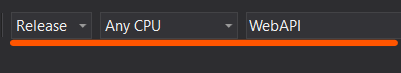

Under the Build menu, first **Clean Solutions** and then **Build Solutio**n operations are performed.

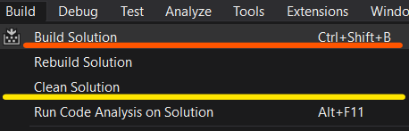

Select the **WebAPI** project from the **Solution Explorer** window and right-click.

Click the **Rebuild** button.

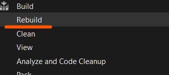

With the **WebAPI** Project selected in the **Solution Explorer** window, the **Show All Files** Button is clicked.

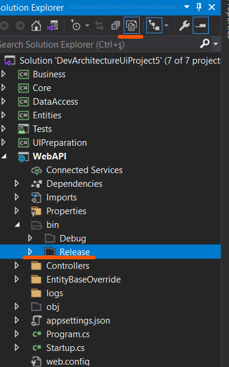

Using the **Open Folder in File Explorer** option opened below, go to the **bin\Release** folder.

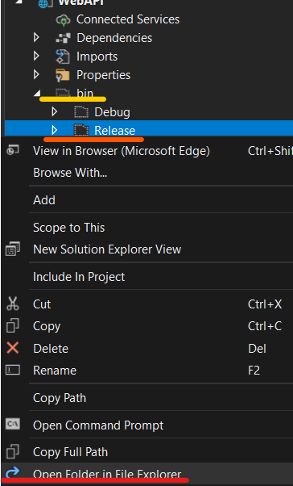

It is entered by double-clicking on the **net6.0** folder in the opened folder.

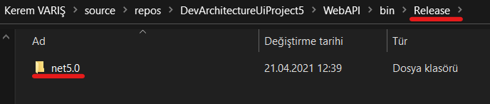

This folder contains the **web.config** file.

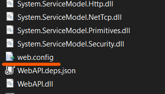

It opens with the help of a text editor such as notepad or notepad++.

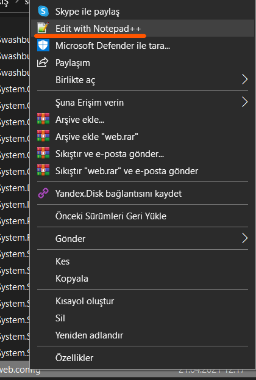

The processPath="**bin\Debug\net6.0\WebAPI.exe**" value

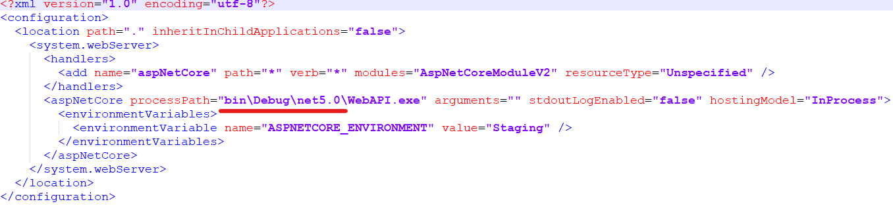

is changed as follows. processPath="**.\WebAPI.exe**"

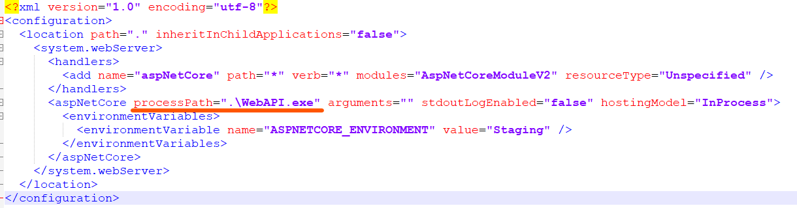

You need to open a folder where you will publish your application under the
C:\inetpub\wwwroot folder on your server and copy your files into it or move
your files to the relevant folder with an FTP client.

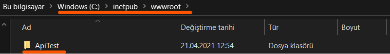

**IIS** opens. From the **Application Pools** menu, click the **Add Application Pool** button.

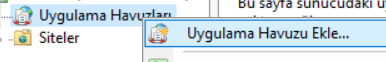

When adding a new application pool, the information other than
**Application Pool Name (Optionally Varies)** for .NetCore applications should be as follows.

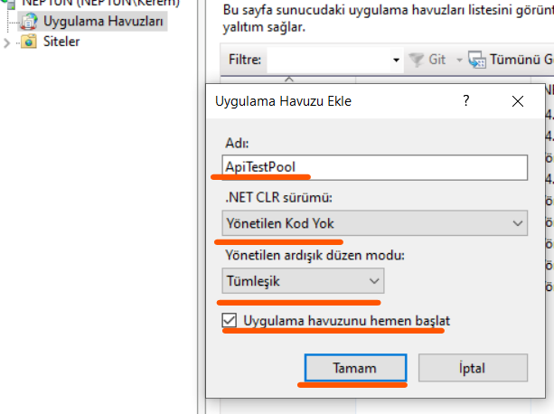

From the Sites menu under IIS, select the folder to which the **Default Web Site** is added 
(***This will vary depending on whether your server is Name Server. It can also work as a domain name such as www.devarchitecture.net**).

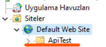

Right click on the folder and click the **Convert to Application** button.

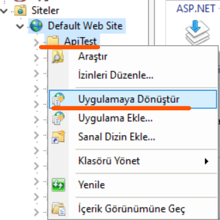

On the screen that opens, click the **Select** button to change the application pool.

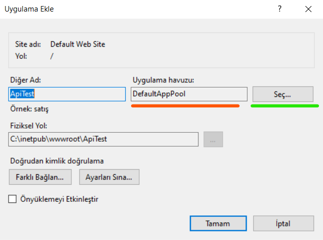

The Application pool that we specified earlier is selected.

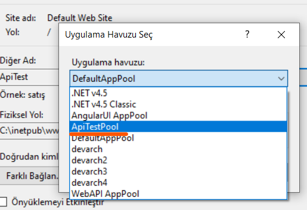

Clicking the **OK** button for closes the screens.

Now, you can test the working state of your application by typing **http://localhost/apitest/swagger/index.html** with a web browser or
**http{s}://<<FIELD_NAME>>/swagger/index.html** if you are on a real server.

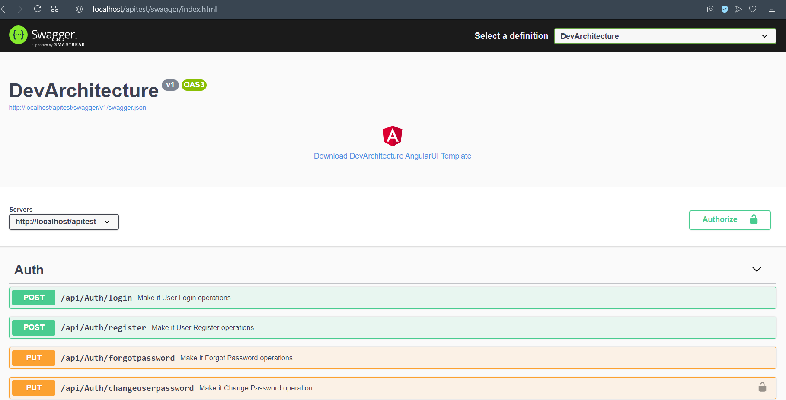

**authors:** Kerem VARIŞ, Veli GÖRGÜLÜ