The project to be published on **Azure** is selected from the **Solution Explorer** window and right-clicked.

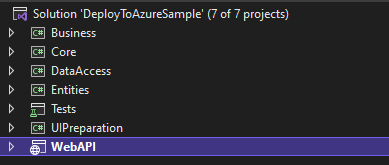

Click the **Publish..** button.

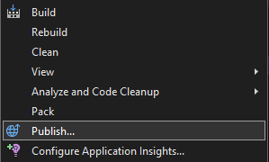

**Azure** is selected as the **Target** and the **Next** button is clicked.

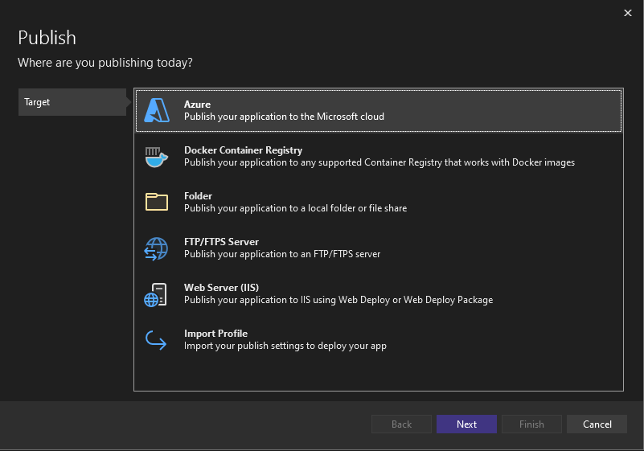

An appropriate option is selected as **Specific Target** and the **Next** button is clicked. In this example, **Windows** has been selected.

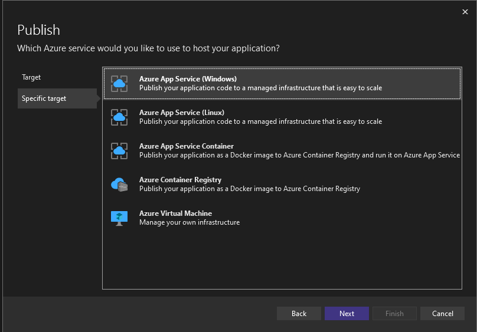

**Azure account** is required to create **App Service**. If you don't have an **Azure account**, create one.

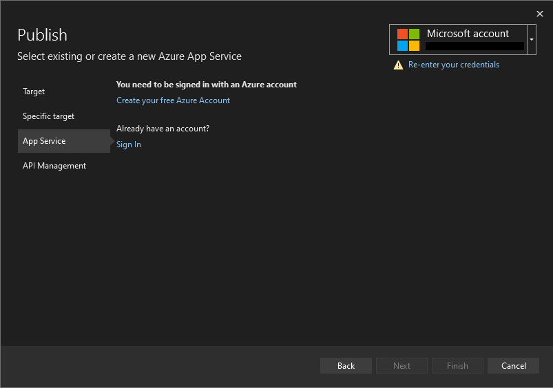

Click the green **+** button to create an **App Service**.

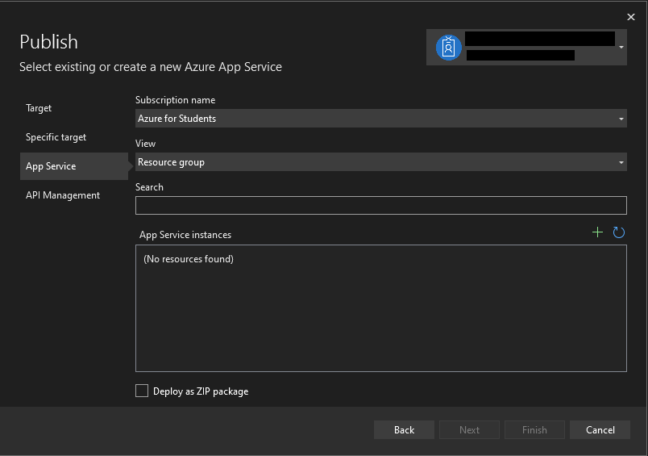

On the page that opens, 4 fields must be filled. The App Service name is determined from the **Name** field.
Subscription type is selected from the **Subscription name** field. A resource group is created by clicking the
**New...** button for the **Resource group** field. For the **Hosting Plan** field, a hosting plan is created by
clicking the **New..** button. After all fields are filled, the **Create** button is clicked.

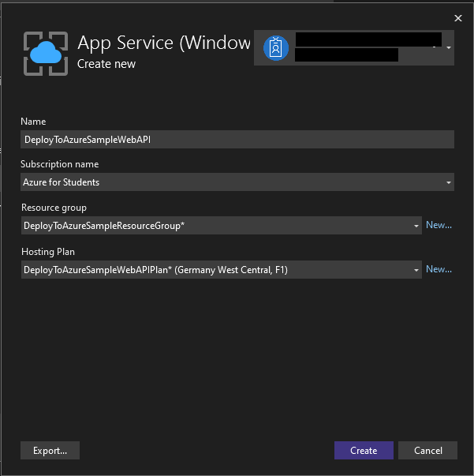

After selecting the **App Service** you have created, click the **Next** button.

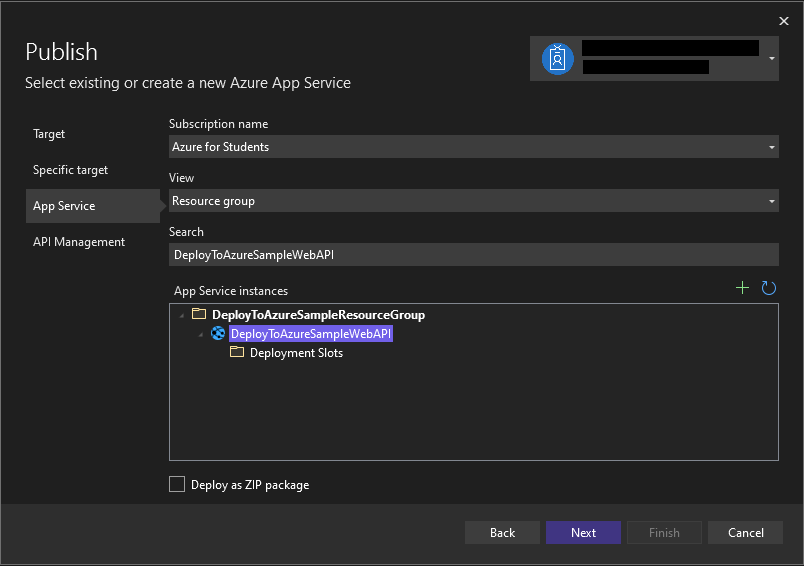

 If API Management, which is an **API management** platform, is desired, the green **+**
 button is clicked and created. Since it will not be used in this example, the **Skip this step**
 option is selected and the **Finish** button is clicked.

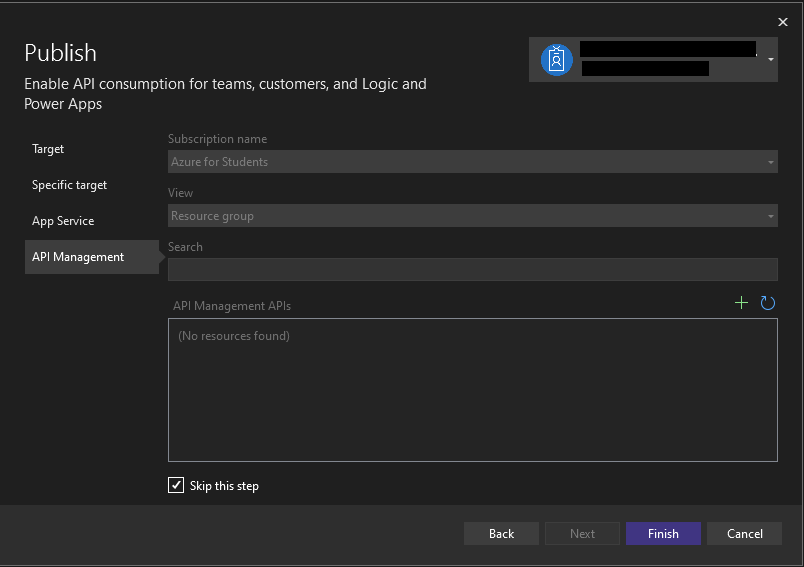

If **Ready to publish** text appears on the publish screen, the **Publish** button is clicked.

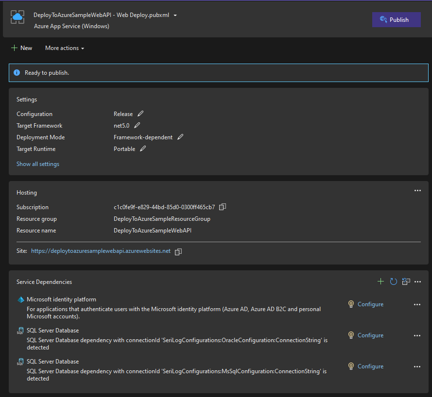

After publishing, you can go to your site by clicking the **Open site** link (the page will not be found because it is an API).

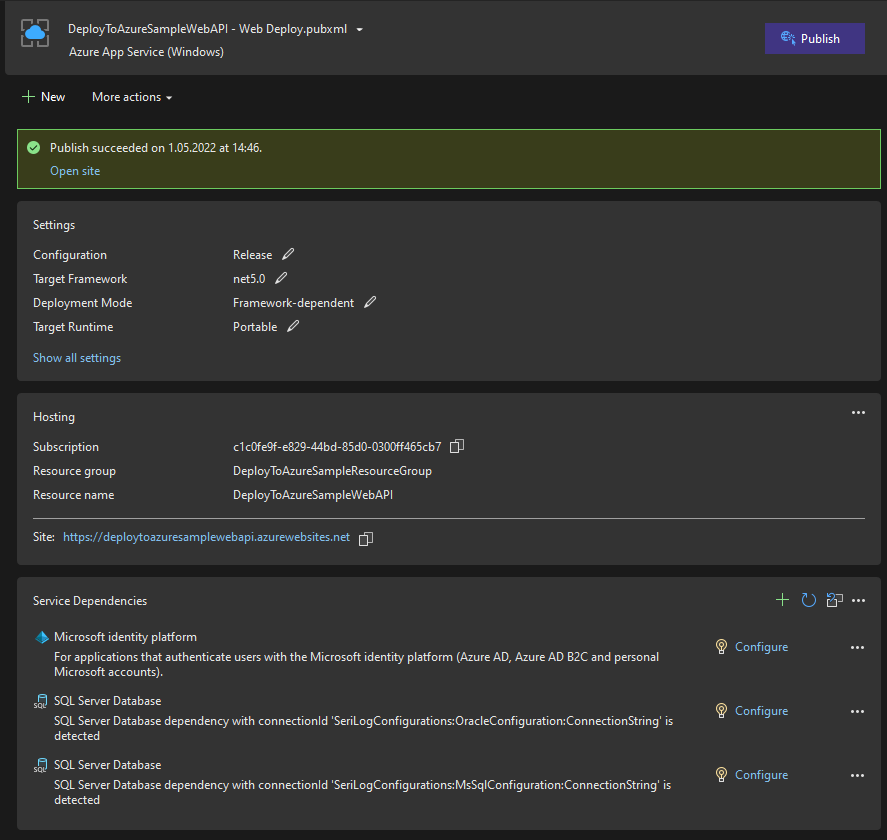

To test the running version of your application on **Swagger**, you can go to http{s}://<<FIELD_NAME>>/swagger/index.html with the help of your browser's address bar.

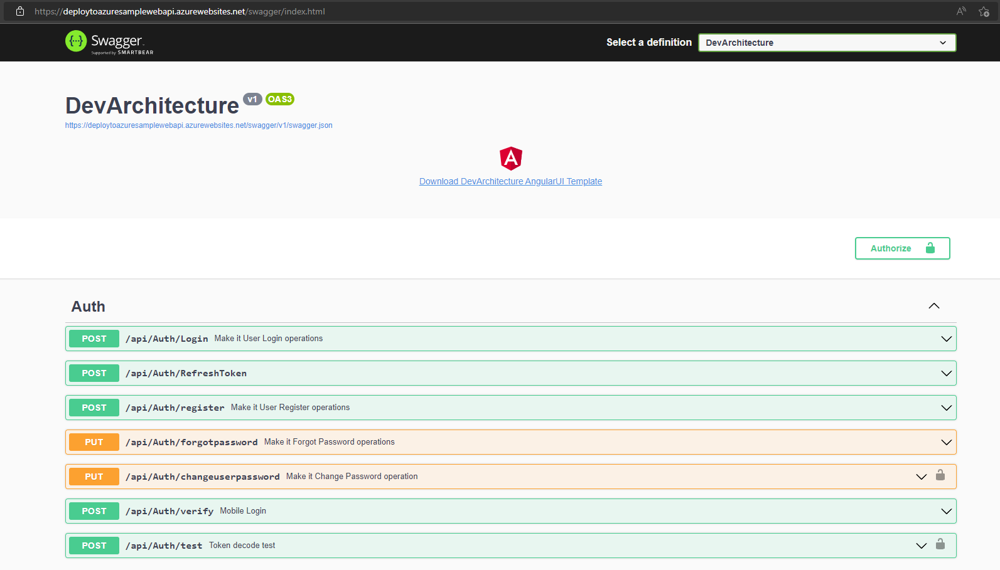

**author:** Veli GÖRGÜLÜ
