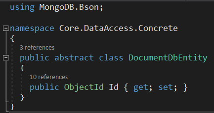
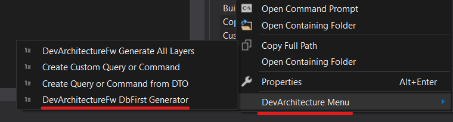
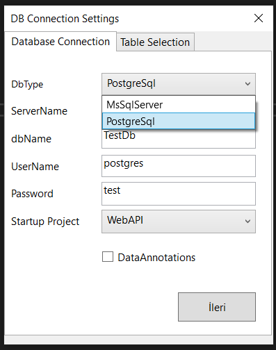
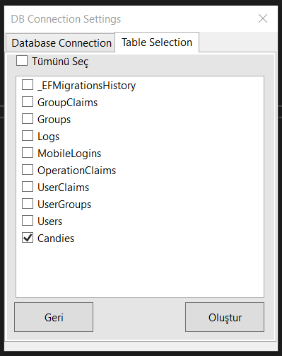
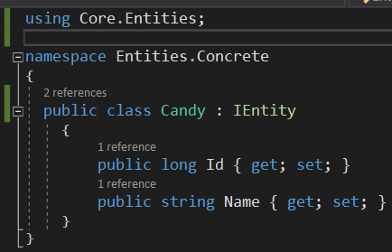
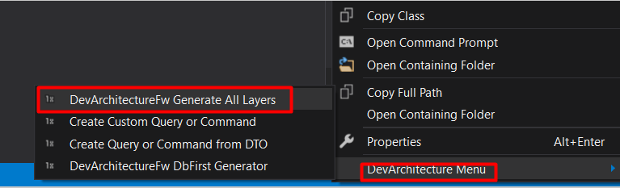

## Code First

*Code First* yaklaşımında iki seçenek ile çalışabilirsiniz

1.  *İlişkisel veri tabanı*

2.  *Doküman odaklı veri tabanı*

### İlişkisel Veri Tabanı 

*Code First* yaklaşımında ilişkisel bir veri tabanı (*RDBMS*) varlık nesnesi
oluşturulacaksa **Entities** katmanında **Concrete** klasörü altında
oluşturulmalıdır.

İlişkisel veri tabanı kullanılacağı zaman yaratılan sınıfın **IEntity**
Interface'inden implement edilmesi beklenmektedir. **DevArchitecture
Code Generator** sizin ilişkisel bir veri tabanı ile çalışmak
istediğinizi buradan anlayacak ve ona göre kod üreteci ilgili metot ve
sınıfları üretecektir. İlişkisel veri tabanı için örnek sınıf yazımı
aşağıdaki şekilde sunulmuştur.

### Doküman Odaklı Veri Tabanı (Document Oriented DB-NoSQL) 

*Code First* yaklaşımında doküman odaklı bir veri tabanı (Document Oriented DB-NoSQL) varlık nesnesi
oluşturulacaksa **Entities** katmanında **Concrete** klasörü altında
oluşturulmalıdır.

Doküman odaklı veri tabanı kullanılacağı zaman yaratılan sınıfın
**DocumentDbEntity** abstract sınıfından miras alması beklenmektedir.
**DevArchitecture Code Generator** sizin doküman odaklı bir veri tabanı
ile çalışmak istediğinizi buradan anlayacak ve ona göre kod üreteci
ilgili metot ve sınıfları üretecektir.

Bu sınıflarda ilişkisel veritabanlarında kullanılan **Birincil Anahtar**
(*Primary Key*) temsil eden property yazılması tavsiye edilmemektedir.
**DocumentDbEntity** abstract sınıfı içinde **MongoDB** için **ObjectId
anahtarı** miras olarak aktarılmaktadır.

**MongoDB** için örnek sınıf yazımı aşağıdaki şekilde sunulmuştur.

## Database First

Database First yaklaşımı için **DevArchitecture Code Generator**
kullanılır.

Açılan ekranda bağlanılacak veri tabanı ve bağlantı bilgileri
tanımlanır. **DevArchitecture MsSqlServer** ve **PostgreSql** için
**Database First** desteğiyle birlikte gelir. Bağlantı bilgileri ve
**Startup Project** **WebAPI** olarak seçildikten sonra ileri butonu
basılır. **Table Selection** tabında Veri Tabanı sınıfları oluşturulacak
olan tablolar seçilir. Oluştur butonuna basılır.

Aşağıdaki Komut Satırı ekranı otomatik olarak kapanır
**Entities\\Conctere** Klasörü altında Veri Tabanı sınıfı ve
**DataAccess\\Concrete\\EntityFramework\\Contexts** klasörü altında
**FakeDbContext** sınıfı oluşturulur. **FakeDbContext** sınıfı sadece
**OnModelCreating** için geçici olarak oluşturulur. Buradan oluşan
ilişkileri gerek duyulursa **DataAccess\\Concrete\\Configurations**
altında kopyala, yapıştır yöntemiyle ayrı sınıflar oluşturarak kullanmaya yarar.

Bu işlemin sonucunda oluşan veri tabanı sınıfı aşağıdaki gibi olmalıdır.

Bu sınıf üzerinde tekrar sağ tıklanır. **DevArchitectureFw Generate All
Layers** tıklanır.

İlgili metot ve sınıflar tüm katmanlar için yaratılır. Ayrıca gerekli
olan Autofac DI Registration işlemleri, **DbContext** için **DbSet**
tanımları gibi gerekli tüm konfigürasyon **DevArchitecture Code
Generator** tarafından gerekli sınıf ve metotlar içerisinde tanımlanır.

