**IIS** (**Internet Information Services**) üzerinde yayınlanacak olan proje ***Solution Configurations*** menüsü üzerinden **Release** Moda alınır. 

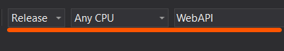

Build menüsü altından önce ***Clean Solutions*** ardından ***Build Solution*** işlemleri gerçekleştirilir.

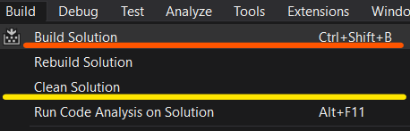

***Solution Explorer*** penceresinden **WebAPI** projesi seçilir ve sağ tıklanır.

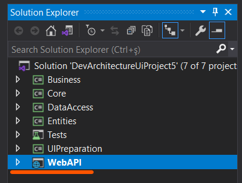

**Rebuild** butonuna tıklanır.

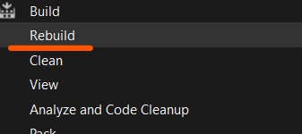

Yine ***Solution Explorer*** penceresinde **WebAPI** Projesi seçili durumdayken. ***Show All Files*** Butonu seçilir 

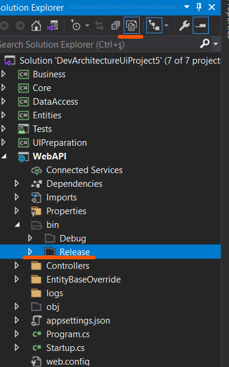

ve aşağıda açılan ***Open Folder in File Explorer*** seçeneği kullanılarak  ***bin\Release*** klasörüne gidilir.

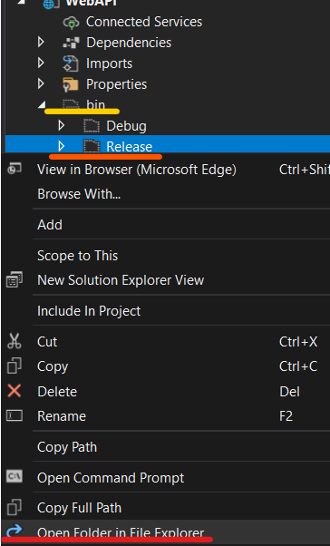

Açılan klasör içinde bulunan **net5.0** klasörüne çift tıklanarak girilir.

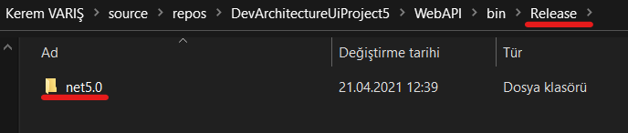

Bu klasör içerisinde **web.config** dosyası bulunur.

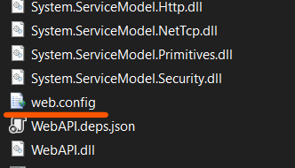

notepad veya notepad++ gibi bir metin editörü yardımıyla açılır.

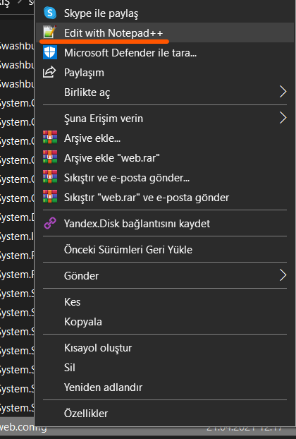

processPath="**bin\Debug\net5.0\WebAPI.exe**"  değeri 

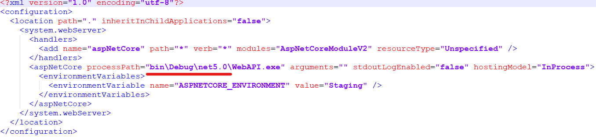

aşağıdaki şekilde değiştirilir. processPath="**.\WebAPI.exe**"

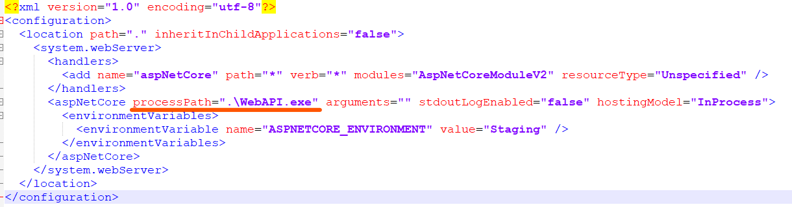

Sunucunuzda bulunan C:\inetpub\wwwroot klasörü altında uygulamanızı yayınlayacağınız bir klasör açıp dosyalarınızı içerisine kopyalarak veya bir FTP istemcisi ile dosyalarınızı ilgili klasöre  taşımanız gerekmektedir.

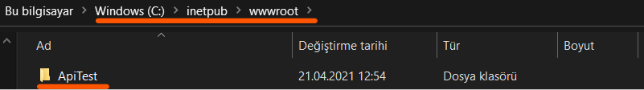

**IIS** açılır **Uygulama Havuzları** menüsünden ***Uygulama Havuzu Ekle** butonuna basılır.

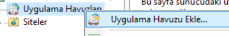

Yeni uygulama havuzu eklenirken .NetCore uygulamaları için **Uygulama Havuzu Adı (Opsiyonel Olarak Değişkenlik gösterir)**  dışındaki bilgiler aşağıdaki gibi olmalıdır. 

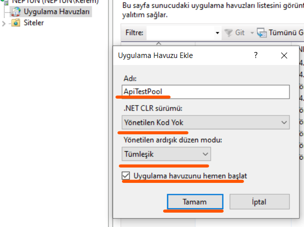

IIS altında Siteler (***Sites***) menüsünden **Default Web Site** (***Burası sunucunuzun Name Server olması durumuna göre değişiklik gösterecektir. www.devarchitecture.net gibi bir alan adı şeklinde de çalışabilir.***) eklenilen klasör şeçilir.

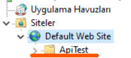

Klasör üzerinde sağ tıklanır ve **Uygulamaya Dönüştür** butonuna basılır.

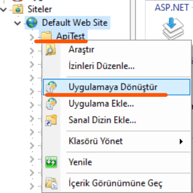

Açılan ekranda uygulama havuzunu değiştirmek için **Seç** butonuna basılır.

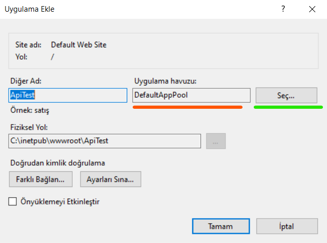

Daha önce belirlediğimiz Uygulama havuzu seçilir. 

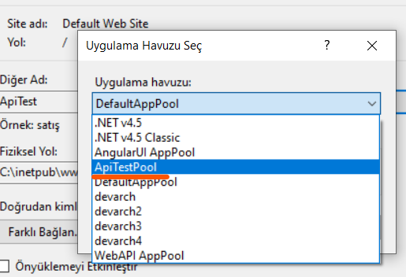

**Tamam** butonlarına tıklanarak ekranlar kapatılır.

artık bir web browser marifetiyle **http://localhost/apitest/swagger/index.html** veya gerçek bir sunucu üzerindeyseniz **http{s}://<<ALAN_ADI>>/swagger/index.html** yazarak uygulamanızın çalışır halini test edebilirsiniz.

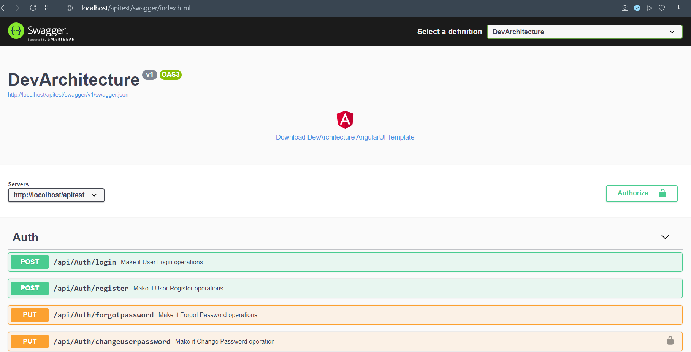