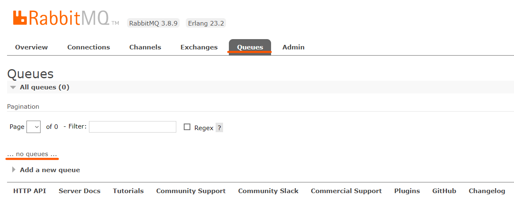
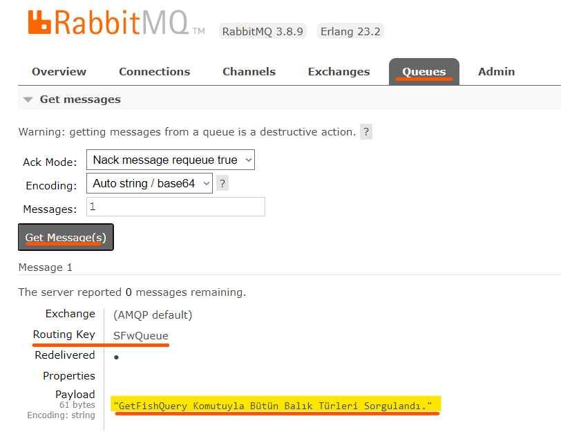

### Tanım
**DevArchitecture**, **RabbitMq** için **Producer** olarak çalışır. 

### Konfigürasyon
Gerekli ayarları tanımlı olarak gelir. **WebAPI** projesi altında bulunan ***appsettings.json*** dosyası içinde **MessageBrokerOptions** anahtarı altından ihtiyaç duyulursa **UserName**, **Password** ve **HostName** değişiklikleri yapılır.

### Kullanım
**RabbitMq** altyapısına bir mesaj gönderilmek istenildiği zaman bir **Command** veya **Query** sınıfı içerisinde gerekli işlem yapılır. 

***IMessageBrokerHelper*** Interface'i ilgili sınıfın **constructor** metotuna **Inject** edilir.

Aynı sınıfın Handle metotu içerisinde inject edilen  *_messageBrokerHelper.***QueueMessage** metotu çağırılır. Bu metot içine metin bazlı ifade alabilir.

**RabbitMq** üzerinde **Queues** sekmesi kontrol edilir.

**Swagger** üzerinden ilgili metot çağrılır.

### Sonuç
Bu metot çağırıldığında otomatik olarak **RabbitMq**'ya belirtilen mesaj gönderilir.

Gönderilen mesajın detayı görüntülenmek istenirse **Queue** detayına gidilerek görüntülenir. .

