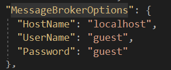
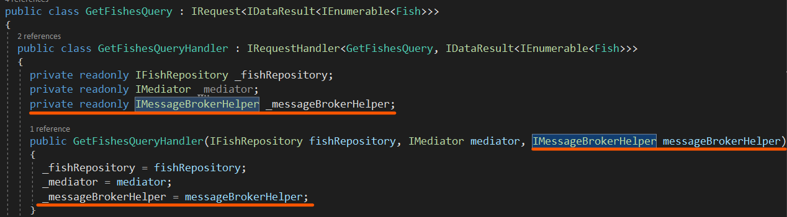
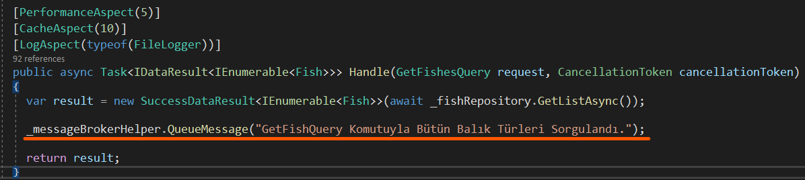
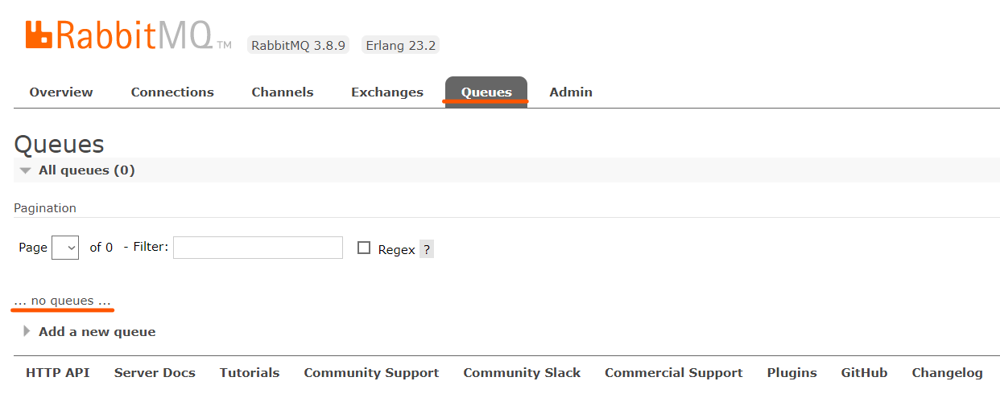
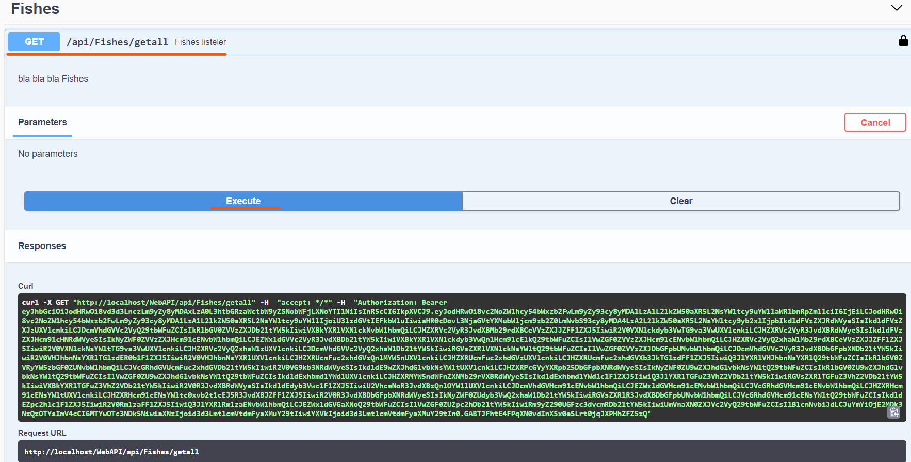
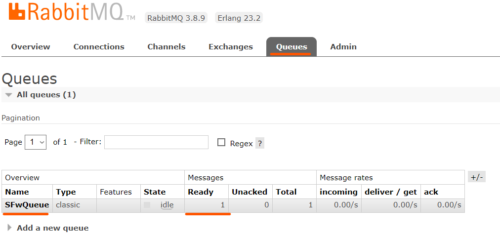
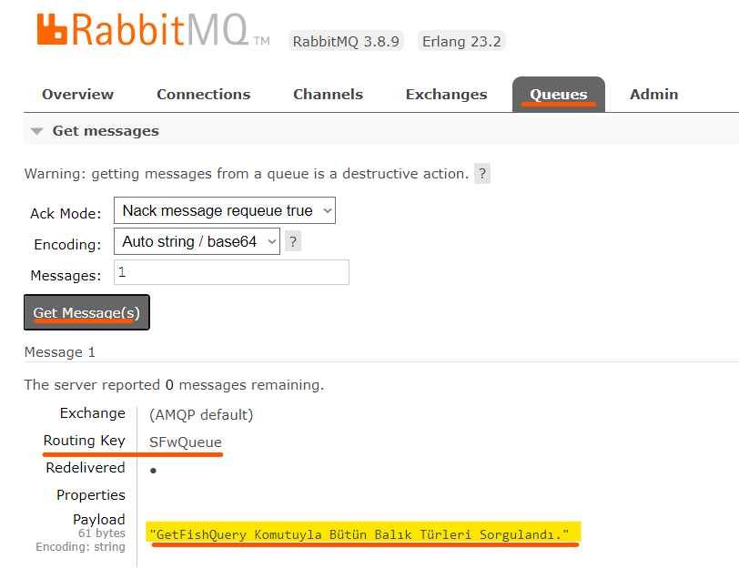

### Definition

**DevArchitecture** works as **Producer** for **RabbitMq**.

### Configuration
Necessary settings are pre-defined. If needed, **UserName**, **Password** and **HostName** changes are made under the **MessageBrokerOptions** key in the **appsettings.json** file under the **WebAPI** project.

### Usage
When a message is wanted to be sent to the **RabbitMq** infrastructure, the necessary action is taken in a **Command** or **Query** class.

The **IMessageBrokerHelper** Interface is **injected** into the **constructor** method of the relevant class.

The "**_messageBrokerHelper.QueueMessage**" method injected in the Handle method of the same class is called. This method can get text-based expressions.

**Queues** tab is checked on **RabbitMq**.

The corresponding method is called via **Swagger**.

### Result
When this method is called, the specified message is automatically sent to **RabbitMq**.

If you want to view the details of the sent message, it is displayed by going to the **Queue** detail.

**authors:** Kerem VARIŞ, Veli GÖRGÜLÜ
