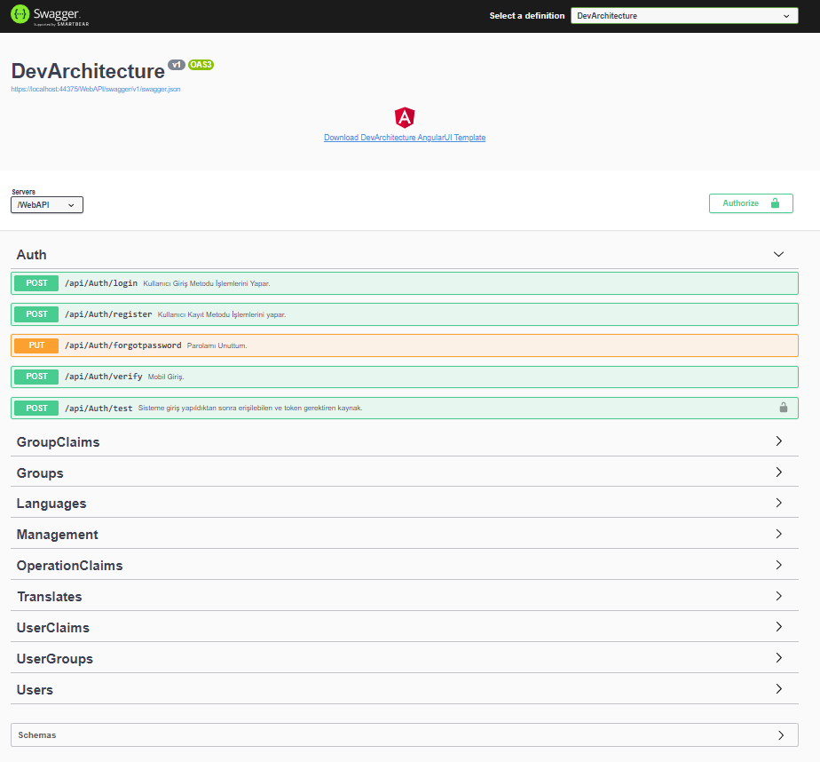
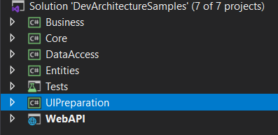
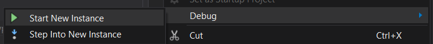
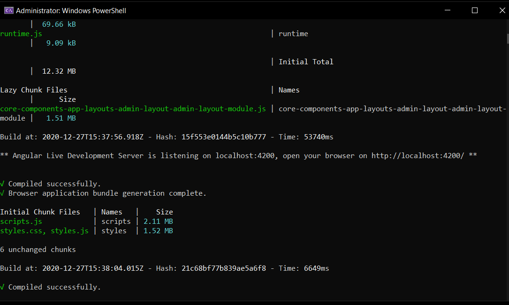
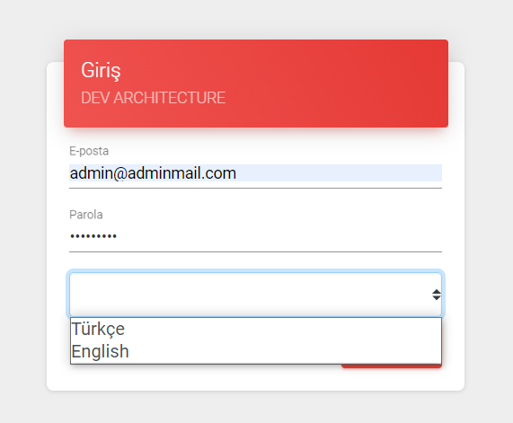
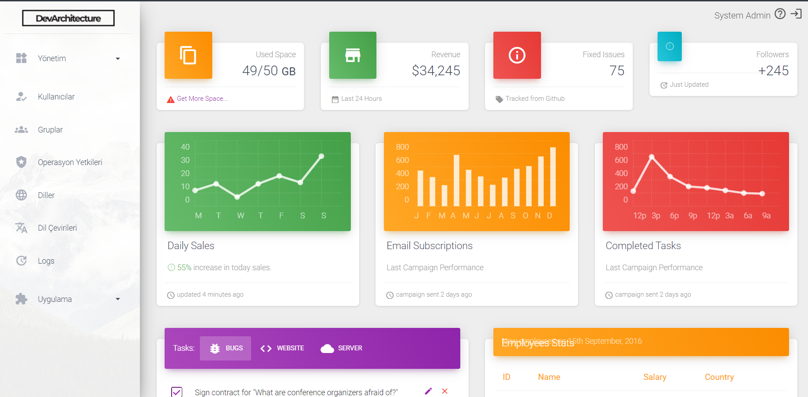

The **WebAPI** project is run in the *Visual Studio* Development environment with the help of the **Start** button on the IDE or by pressing the *F5* or *CTRL + F5* keys on the keyboard. (bkz. [***Running The Web API Project***](runprojectwebapi))

Right click on the **UIPreparation** project.

With the **Start New Instance** option under the **Debug** menu in the menu that opens, this project is also run without stopping the **WebAPI** project.

This project will make the necessary setups for the ***Angular*** interface. Respectively:

-   **Nodejs** packages will be downloaded

-   **VsCode** environment will open for project

-   The command **ng serve --open** will be run and the project will open with the default browser..

When the login screen comes

**Username:** admin@adminmail.com

**Password:** Q1w212\*\_\*

Login to the system using the information.

**Congratulations!** Welcome aboard now as a **DevArchitecture** developer!

**authors:** Kerem VARIŞ, Veli GÖRGÜLÜ