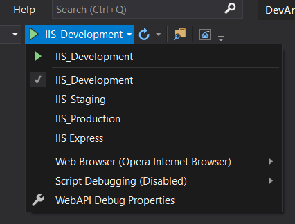
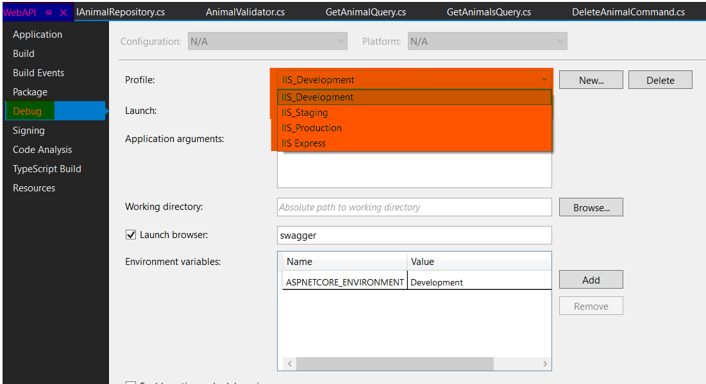
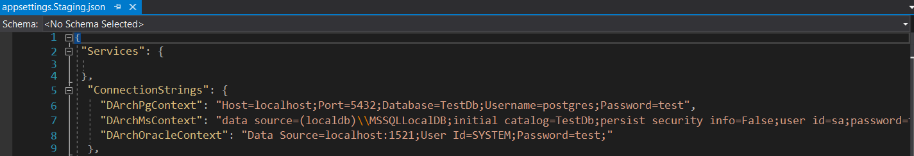
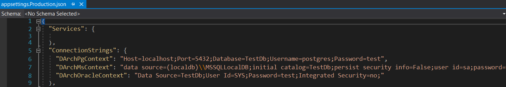

In order to run the ***WebAPI*** Project, the environment variable must first be selected
through ***Visual Studio 2019***. The structure of the environment variables seen on the
screen is explained in the subheadings.

If you want to make changes on these configurations, right click on **WebAPI**.
Click the **Properties** menu from the drop-down menu. On the screen that opens,
the desired arrangement is made from the **Debug** tab.

## WebAPI

### IIS Express

When the project is started by selecting this environment variable,
the project runs with **InMemoryDb** support. You can make your project work without
the need for any database setup. The **IIS Express** environment variable comes
by default with Visual Studio.

### IIS_Development

When the project is started by selecting this environment variable,
the project runs with **InMemoryDb** support. You can make your project
work without the need for any database setup. The **IIS_Development** environment
variable is an environment variable defined specifically for the DevArchitecture
project. It is the recommended environment variable for the developer environment.
There is no need to make any changes in **appsettings.Development.json** in the **WebAPI** project.

### IIS_Staging

When the project is started by selecting this environment variable,
the project works with **PostgreSql** or **Ms Sql Server** support.
To work with these databases, the necessary setups and configurations must be made.
The **IIS_Staging** environment variable is an environment variable that is defined
specifically for the **DevArchitecture** project. It is the recommended environment variable
for ***Developer*** and ***Demo*** environment. In the **appsettings.Staging.json** file in the
**WebAPI** project, database connection sentences are arranged according to the existing configurations.

### IIS_Production

When the project is started by selecting this environment variable, the project works with
PostgreSql or Ms Sql Server support. To work with these databases, the necessary setups
and configurations must be made. The **IIS_Production** environment variable is an environment
variable defined specifically for the **DevArchitecture** project. It is the recommended environment
variable for the ***Live*** environment. The database connection sentences are arranged according
to the existing configurations in the **appsettings.Production.json** file in the **WebAPI** project.

**Username:** admin@adminmail.com

**Password:** Q1w212\*\_\*

Login to system is made using the **/api/Auth/login** address and login information in the **Auth** module via ***Swagger***.

**Congratulations!** Welcome aboard now as a **DevArchitecture** developer!

**authors:** Kerem VARIŞ, Veli GÖRGÜLÜ