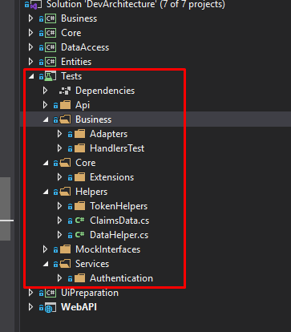
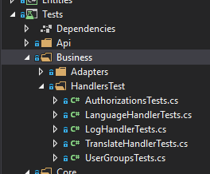
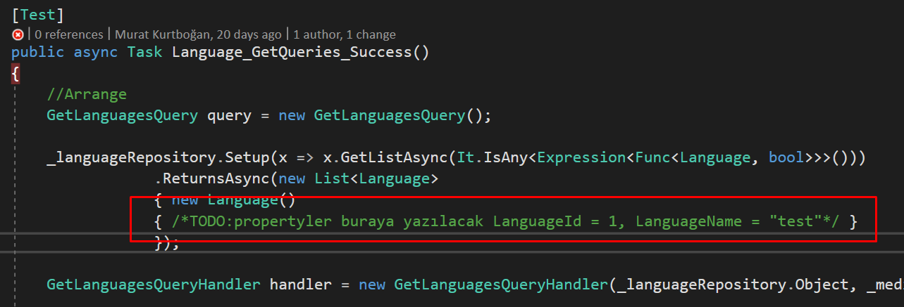

## Test Routines Management

**DevArchitecture** includes a test project. It includes both unit testing
and integration testing. The basic infrastructure of the tests related
to the layers has been created.

One of the layers derived from **DevArchitecture Code Generator** and **IEntity** and **DocumentDbEntity**
class is the test class of the related entity. When all layers are created from **Entities** with
**DevArchitecture Code Generator**, a test class is automatically created under the
**Test -> Business -> HandlerTest** folder.

At the beginning of the most common problems with test writing, when test routines are written,
there are problems such as not being able to find how to **Setup** and naming.
**DevArchitecture Code Generator** aims to provide **Setup** and test routine classes ready-made.

It is up to the user to develop test routines after this stage.
Checking whether there is an error by running tests before the
application release will provide a healthier SDLC environment.

**Note:** In test cases that require Mock Data, the developer has to define Mock Data.
**DevArchitecture Code Generator** creates these fields by taking it to the comment line them **especially**.
The developer needs to both examine and edit these fields belonging to the relevant class.
**DevArchitecture Code Generator** is designed to provide the necessary redirection in comments.

**Example Mock Data Scope**

**authors:** Kerem VARIŞ, Veli GÖRGÜLÜ