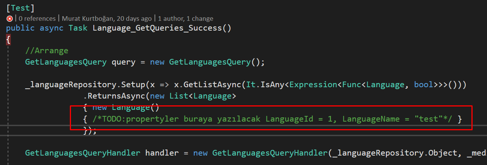

## Test Rutinleri Yönetimi
**DevArchitecture** bünyesinde test projesi barındırmaktadır.
İçerisinde hem birim test hem de entegrasyon testlerini
bulundurmaktadır. Katmanlar ile ilgili testlerin temel düzeyde alt
yapısı oluşturulmuştur.

**DevArchitecture Code Generator** ile **IEntity** ve
**DocumentDbEntity** sınıfından türetilen katmanlardan bir tanesi de
ilgili entity'e ait test sınıfıdır. **DevArchitecture Code
Generator** ile **Entity**'lerden tüm katmanlar oluşturulduğu zaman **Test
-/> Business -/> HandlerTest** klasörünün altına otomatik olarak test sınıfı da
oluşturulmaktadır.

Test yazma ile ilgili olarak en çok yaşanan problemlerin başında test rutinleri yazılacağı zaman
**Setup**'ın nasıl yapılacağını bulamama, isimlendirme vb. problemler gelmektedir.
**DevArchitecture Code Generator**, **Setup** ve test rutini
sınıflarını hazır olarak sunmayı hedefler.

Bu aşamadan sonraki test rutinlerini geliştirmek kullanıcının isteğine
bağlıdır. Uygulama yayınlama öncesi testler çalıştırılarak bir hatanın
olup olmadığının kontrol edilmesi daha sağlıklı bir SDLC ortamı
sağlayacaktır.

**Not:** Mock Data gerektiren test senaryolarında geliştirici Mock
Data'yı tanımlamak zorundadır. **DevArchitecture Code Generator** bu
alanları **özellikle** yorum satırına alarak oluşturmaktadır.
Geliştiricinin ilgili sınıfa ait bu alanları hem incelemesi hem de
düzenlemesi gerekmektedir. **DevArchitecture Code Generator** yorum satırlarında gerekli yönlendirmeyi yapmak üzere tasarlanmıştır.

**Örnek Mock Data Alanı**

**author:** Kerem VARIŞ