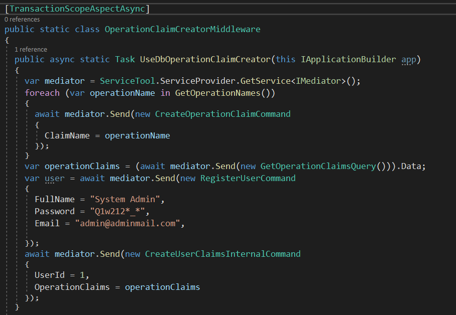

**TransactionScopeAspectAsync** is used as **Attribute** on **Handle** methods in **Command and Query** classes located under
**Business -> Handlers -> 'ClassName'** folder. The following representative class is used as an example.

**TransactionScopeAspectAsync** is used when multiple **Command** structures need to be called within a **Command** or **Query** class.
All methods in transactional operations are executed. If all transactions are successful, the transaction is completed
successfully. If a method from the invoked methods encounters an error result, **Rollback** is run and all successful operations
are rolled back and the process is terminated.

**authors:** Kerem VARIŞ, Veli GÖRGÜLÜ
