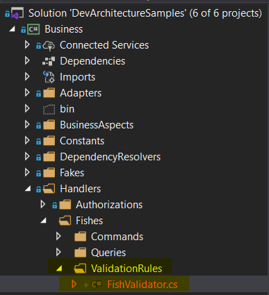
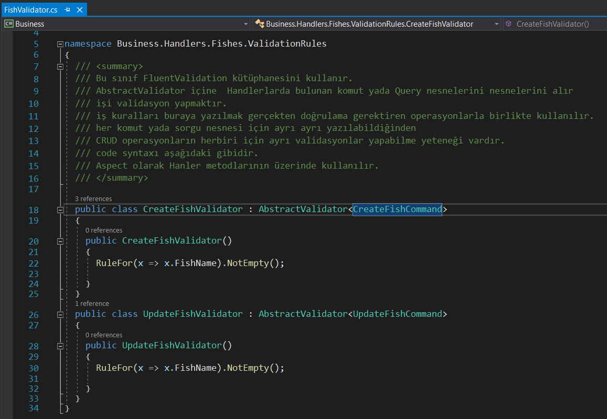

**ValidationAspect**'ler özel durum ve kullanıma sahip aspect attirbutelarıdır. **DevArchitecture Code Generator** ile oluşturulduğunda ilgili sınıfın **Business -> Handlers -> <SınıfAdi> -> ValidationRules** klasörü altında ***Create ve Update Command***'ları için tüm propertyleri içeren ve ***NotEmpty()*** olarak işaretlenmiş şekilde hazır bir metot ile birlikte gelir. 

Validasyon için gerekli değişiklikler bu sınıf içerisinde yapılmalıdır. Bu sınıf **FluentValidation** kütüphanesini kullanır. **AbstractValidator** içine  **Business -> Handlers <SınıfAdi>** klasörü altında bulunan **Command** veya **Query** nesnelerini alır. ***CRUD*** operasyonların herbiri veya özel bir durum için ayrı validasyon yazılabilir. 

**ValidationAspect**'ler **Business -> Handlers -> <SınıfAdi>** *Command* ve *Query* sınıflarında **Handle** metotları üzerinde **Attribute** olarak kullanılır.

Kullanımı şekildeki gibidir. **ValidationAspect** attribute içine ***SinifAdi*Validator.cs** sınıfı içinde bulunan metotları ve ayrıca **Priority** değeri alır. **Priority** özelliği Aspectlerin metodlar üzerinde çalışması sırasını belirlemek için kullanılır.

**NOT: Bu sınıf içerisinde kesinlikle veriyi ve/veya veri tabanını doğrudan etkileyecek bir iş kodu yazılmamalıdır. Bu sınıf önyüz çatılarından gelen değerlerin doğrulması için kullanılmalıdır.**