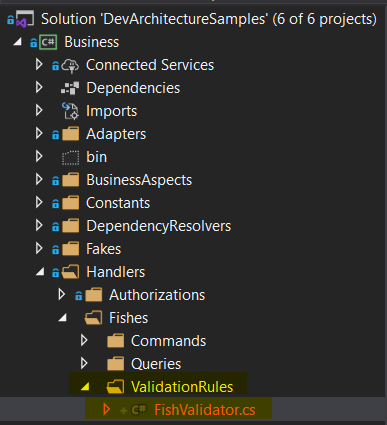
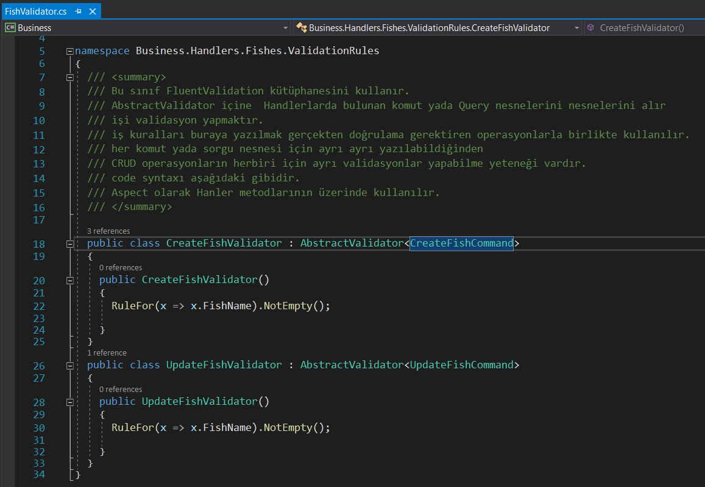
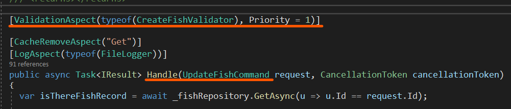

**ValidationAspects** have special status and usage. When created with **DevArchitecture Code Generator**,
it comes with a ready method marked ***NotEmpty()***, which contains all the properties for the
***Create and Update Commands*** under the **Business -> Handlers -> 'ClassName' -> ValidationRules**
folder of the relevant class.

Changes required for validation must be made within this class. This class uses the **FluentValidation** library.
It takes **Command** or **Query** objects in the **AbstractValidator** under the **Business -> Handlers 'ClassName'** folder.
A separate validation can be written for each of the ***CRUD*** operations or for a special case.

**ValidationAspects** are used as **Attributes** on **Handle** methods in **Business -> Handlers -> 'ClassName'** *Command* and *Query* classes.

Usage is as follows. It takes the methods contained in the ***ClassName*Validator.cs** class. The **Priority** property is used to specify the order in which aspects work on methods.

**NOTE: No business code that will directly affect the data and/or database should be written in this class. This class should be used for validation of values from Front-end.**

**authors:** Kerem VARIŞ, Veli GÖRGÜLÜ