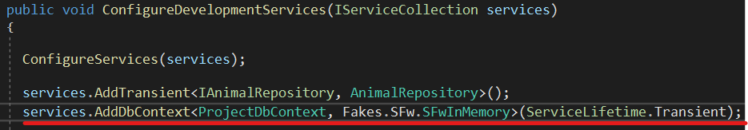
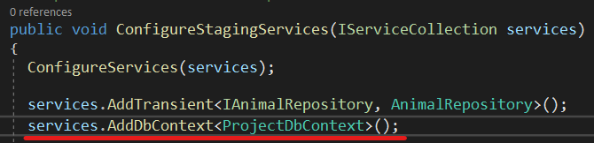

## Business Katmanı
### Startup Sınıfı
**Business->Startup.cs** sınıfına **Autofac** için gerekli olan **Register** işlemi burada konfigüre edilir. Burası aynı zamanda **Development, Staging, Production** ortam değişkenlerinin yönetildiği yerdir. (***Ortam değişkenlerinin detayı için bkz.*** [***Web Api Projesini Çalıştırma***](projecalistirmawebapi))
 Tüm ortam değişkenleri için konfigürasyon **DevArchitecture Code Generator** tarafından tanımlanır.

 

Bu sınıf aynı zamanda sistemin hangi veri tabanı ile çalışacağını belirlemek için de kullanılır.

### ConfigureDevelomentServices Sınıfı
**ConfigureDevelomentServices** metotu ön tanımlı olarak **InMemoryDb** ile çalışacak şekilde konfigüre edilmiştir.
Herhangi bir değişiklik yapılması gerekmemektedir.

### ConfigureStagingServices Sınıfı
**ConfigureStagingServices** metotu ön tanımlı olarak **PostgreSql** ile çalışacak şekilde konfigüre edilmiştir. [Download PostgreSql](https://www.postgresql.org/download/)

**MsSql** kullanılmak istenirse aşağıdaki şekilde kullanılır.
[Download MsSql](https://www.microsoft.com/en-us/sql-server/sql-server-downloads)

### ConfigureProductionServices Sınıfı
**ConfigureProductionServices** metotu ön tanımlı olarak **PostgreSql** ile çalışacak şekilde konfigüre edilmiştir.
[Download PostgreSql](https://www.postgresql.org/download/)

**MsSql** kullanılmak istenirse aşağıdaki şekilde kullanılır.
[Download MsSql](https://www.microsoft.com/en-us/sql-server/sql-server-downloads)

**author:** Kerem VARIŞ