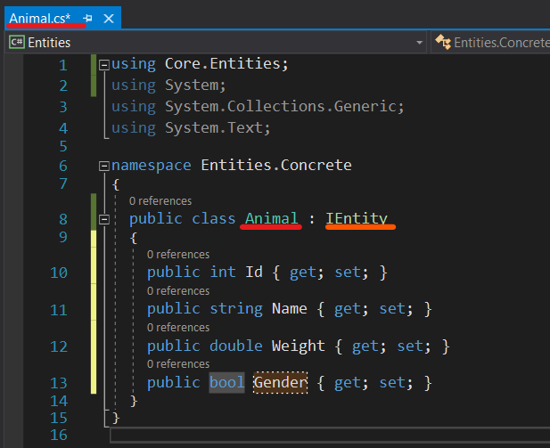
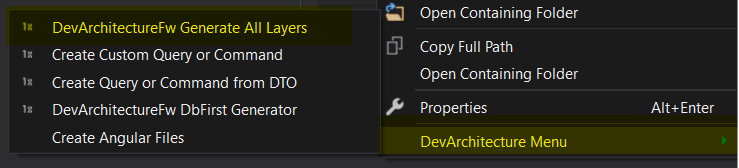
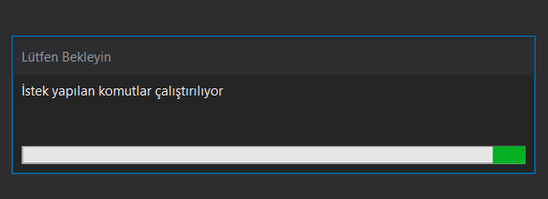
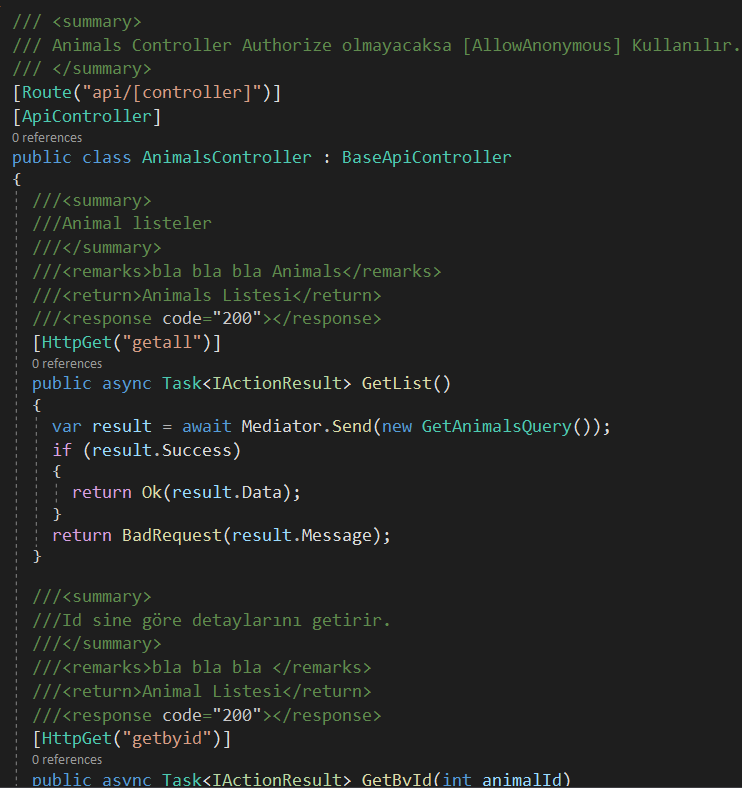

### İlişkisel Veri Tabanı 

*Code First* yaklaşımında ilişkisel bir veri tabanı (*RDBMS*) varlık nesnesi
oluşturulacaksa **Entities** katmanında **Concrete** klasörü altında
oluşturulmalıdır.

İlişkisel veri tabanı kullanılacağı zaman yaratılan sınıfın **IEntity**
Interface'inden implement edilmesi beklenmektedir. **DevArchitecture
Code Generator** sizin ilişkisel bir veri tabanı ile çalışmak
istediğinizi buradan anlayacak ve ona göre kod üreteci ilgili metot ve
sınıfları üretecektir. İlişkisel veri tabanı için örnek sınıf yazımı
aşağıdaki şekilde sunulmuştur.

Oluşturulan bu sınıf üzerinde sağ tıklanır ve **DevArchitecture Code Generator** Menüsüne ulaşılır.

 

**DevArchitectureFw Generate All Layers** tıklanır.

 

Tüm katmanlar için gerekli sınıf, metot ve konfigürasyonların oluşturulması için kısa bir süre beklenir.

 

## DataAccess Katmanı

### ProjectDbContect Sınıfı

**DataAccess->Concrete->EntityFramework->Contexts->ProjectDbContext** içine **DbSet** Tanımlama işlemi otomatik olarak yapılmıştır.

 

Bu işlem sonunda bir **Migration** ihtiyacı oluşmuşsa **Migration** işlemi başlatılır. (bkz. [***Migration Yönetimi***](migration))

## Business Katmanı
### Startup Sınıfı
**Business->Startup.cs** sınıfına **Autofac** için gerekli olan **Register** işlemi burada konfigüre edilir. Burası aynı zamanda **Development, Staging, Production** ortam değişkenlerinin yönetildiği yerdir. Tüm ortam değişkenleri için konfigürasyon **DevArchitecture Code Generator** tarafından tanımlanır.

 

Bu sınıf aynı zamanda sistemin hangi veritabanı ile çalşacağını belirlemek için de kullanılır.

**ConfigureDevelomentServices** metotu ön tanımlı olarak **InMemoryDb** ile çalışacak şekilde konfigüre edilmiştir.
Herhangi bir değişiklik yapılması gerekmemektedir.

**ConfigureStagingServices** metotu ön tanımlı olarak **PostgreSql** ile çalışacak şekilde konfigüre edilmiştir.

**MsSql** kullanılmak istenirse aşağıdaki şekilde kullanılır.

**ConfigureProductionServices** metotu ön tanımlı olarak **PostgreSql** ile çalışacak şekilde konfigüre edilmiştir.

**MsSql** kullanılmak istenirse aşağıdaki şekilde kullanılır.

### Handler Klasörü
CQRS tabanlı sistem metotları ve validasyon tanımları burada oluşturulmaktadır. Oluşturulan sınıf için tüm metotlara aşağıdaki gibi ulaşılır. Yeni bir metod ihtiyacında ilgili klasör altında **DevArchitecture Code Generator** şablon metotları sınıf nesnesi üzerinde sağ tıklanarak oluşturulur.

## WebAPI Katmanı
Bu katman dış dünyayla haberleşmenin yapıldığı ilk giriş noktasıdır. **Business** katmanında bulunan **Handler**'larda tanımlı olan tüm operasyonlar burada otomatik olarak tanımlı gelir özellikle bir kontrol yapmaya gerek yoktur. **Controller**ların içine yeni bir metot eklenmediği sürece özel bir mekanizması bulunmamaktadır.

**Swagger** üzerinden api dökümantasyonunu zenginleştirmek isterseniz **Controller**lar üzerinde bulunan **summary**leri düzgünce yazmanız apiyi kullanacak olan geliştiriciler için faydalı olacaktır.

Aşağıdaki ekran görüntüsüne erişildiğinde yeni oluşturulan modül artık kullanıma hazırdır.

