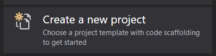
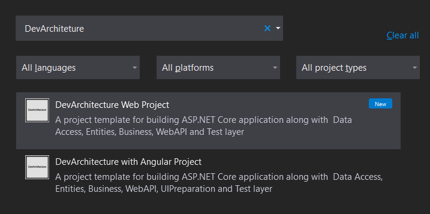
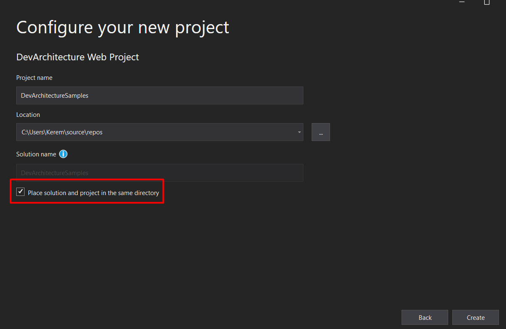

Visual Studio 2019 açılır. Create a new project seçeneği tıklanır.

Açılan ekranda **Arama** (Search) alanına **DevArchitecture** yazılır ve
gelen **DevArchitecture Web Project** veya **DevArchitecture with
Angular Project** proje şablonu seçilir.

Proje şablonu seçildikten sonra **Next** butonuna basılır. Gelen ekranda
Projeye verilecek olan isim ve projenin dosya sistemindeki konumu
belirlenir. Burada kırmızı çerçeveyle işaretlenmiş **Place solution and
Project in the same directory** seçeneğinin işaretli olduğuna emin
olunuz. Sonrasında **Create** butonuna basılarak proje şablonu hazır
hale getirilir.

Aşağıdaki ekran görüntüsüyle karşılaştığınızda hiç problem olmadan
projenizi kodlamaya başlayabilirsiniz.

Tebrikler! artık bir **DevArchitecture** geliştiricisi olmaya
hazırsınız.