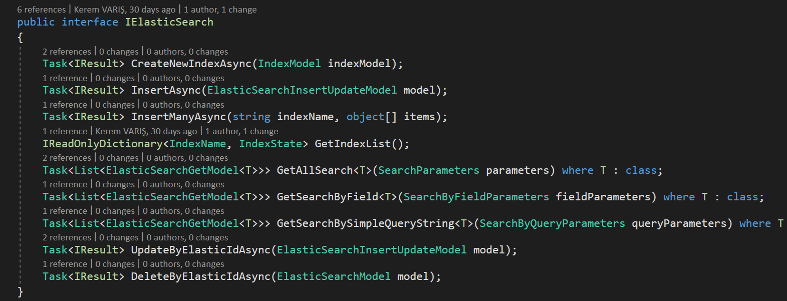

**DevArchitecture**, **ElasticSearch** desteği ile birlikte
gelir. **ElasticSearch** desteği için **Nest** kütüphanesini
kullanmaktadır. Nest kütüphanesi için ***https://github.com/elastic/elasticsearch-net*** adresini kullanabilirsiniz.

**ElasticSearch** ile ilgili sınıflar **Core** katmanında
**Utilities** altında **ElasticSearch** klasöründe
bulunmaktadır.

**ElasticSearch** sunucusuna bağlanmak için **appsettings.json**
dosyasındaki **ElasticSearchConfig** modülündeki alanlar
doldurulmalıdır.

**ElasticSearch** operasyon işlemleri **IElasticSearch**
interfacesinde tanımlanmıştır. Base olarak **ElasticSearchManager**
sınıfı kullanılmaktadır. **DevArchitecture**, **ElasticSearch**
üzerinde index oluşturma, data ekleme, birden fazla data ekleme, data
güncelleme, data silme, data listeleme, field ismine göre data listeleme
ve query göre data listeleme operasyonlarını desteklemektedir.

**DevArchitecture ElasticSearch** operasyonları

***Not***: **ElasticSearch**' de Insert işleminde ilgili
index'in oluşturulup oluşturulmadığı kontrol edilmelidir.
***GetIndexList()*** metodu ile mevcut Indexlerin listesine
erişilir. Eğer index yok ise ***CreateNewIndexAsync()*** metodu
kullanılarak index oluşturulabilinir.

**Not: İndex isimleri küçük harf olmalıdır**

**ElasticSearch** işlemlerinde, **ElasticSearch** işlemleri için
kendi ("**/_id**") alanı kullanılmaktadır. Bu alan **Nest**
kütüphanesinde ki **Nest.Id** alanıdır. Bu alan
**DevArchitecture**'da **ElasticSearchModel** sınıfında
tanımlıdır. Diğer *CRUD* işlemler için kullanılan
**ElasticSearchInsertManyModel**,
**ElasticSearchInsertUpdateModel**, **ElasticSearchModel**
sınıfını base sınıf olarak kullanmaktadır. Ayrıca her *CRUD* işleminde
kullanılan **IndexName** alanı da bu base sınıfta tanımlıdır.

**ElasticSearch** üzerinden yapılan **Get** işlemlerinde
**ElasticSearchGetModel** sınıfı response model olarak
kullanılmaktadır. Bu model generic type özelliğine sahiptir. Default
olarak **ElasticSearch** ("**/_id**") değerini ve generic type da tanımlanan
sınıf tipinde ki nesneyi dönmektedir.

Örnek **ElasticSearch** *Get* metodu

Örnek **ElasticSearch** Sonucu.

**author:** Kerem VARIŞ