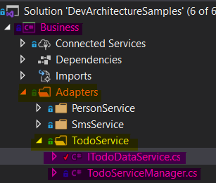
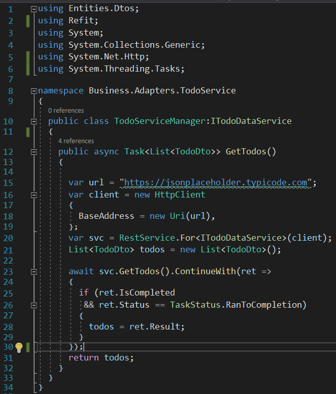
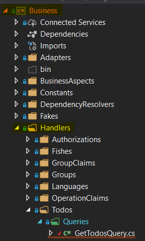
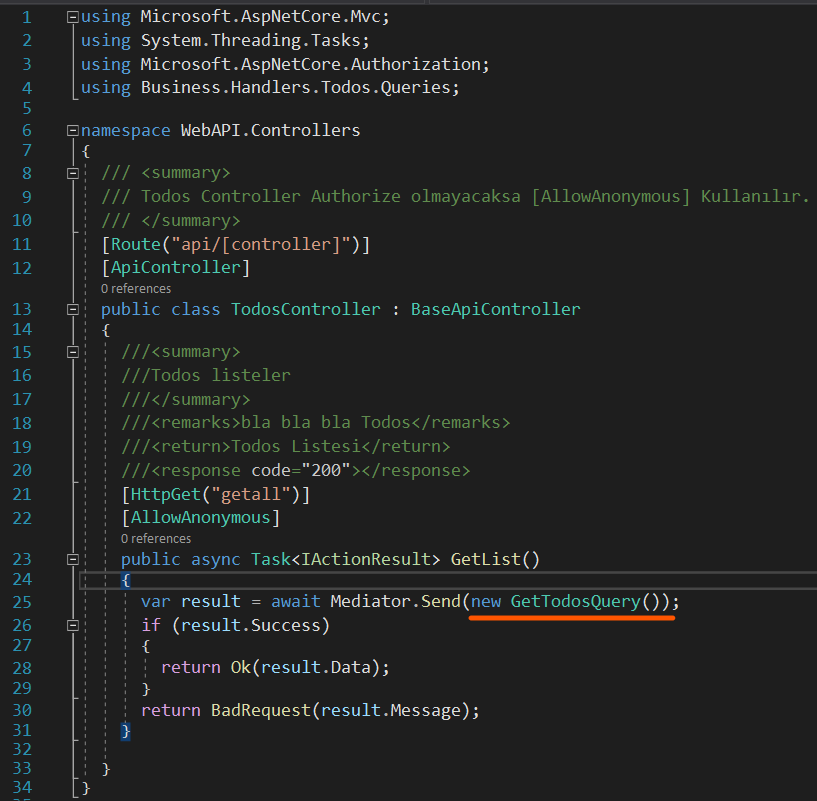
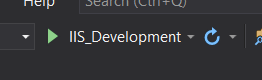
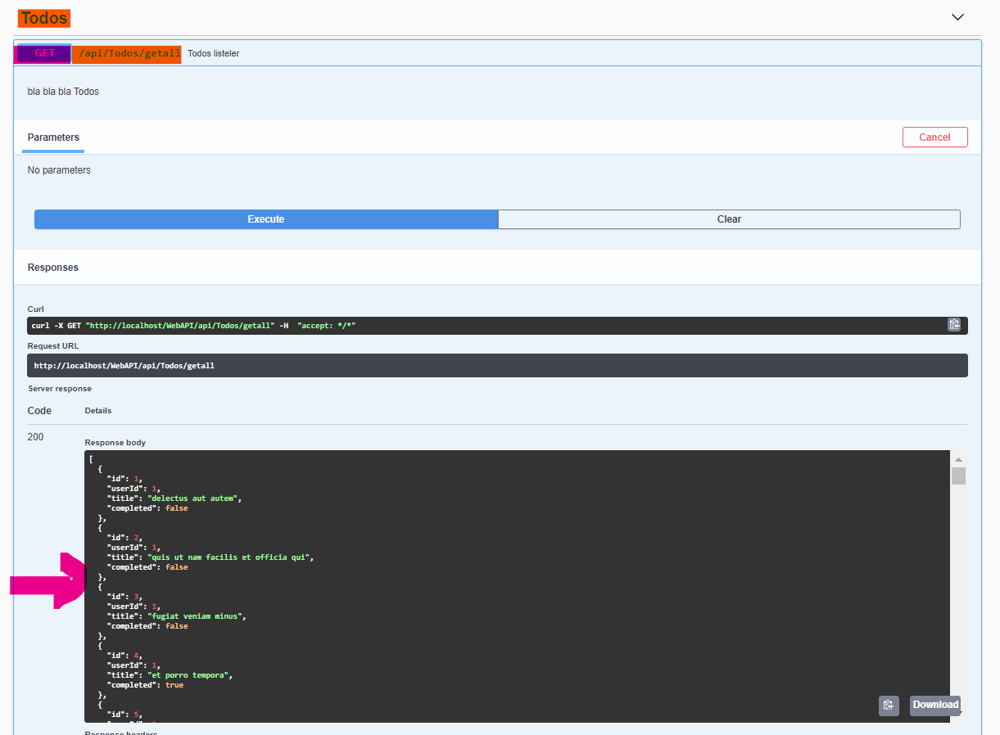

## WebService Entegrasyonu
### WebService Örneği
Webservice entegrasyonu örnek uygulaması için https://tckimlik.nvi.gov.tr/Service/KPSPublic.asmx servisi kullanılmıştır. Bu servisin beklediği bilgiler aşağıda bulunan şekilde işaretlenmiştir. 

### Kullanımı
**Connected Services** eklendikten sonra dış servislerle iletişim noktası olarak **Business -> Adapters** klasörü kullanılır. 

### Uygulanması
Belirli bir düzen sağlamak için **Adapters** klasörü altında **PersonService** isminde bir klasör oluşturulur. Bu servisi temsil eden bir **IPersonService** Interface'i ve ***VerifyCid*** isminde dış servisin beklediği propertyleri temsil eden bir metot ile ilk giriş noktası oluşturulur. 

**IPersonService** Interface'inin implementasyonu aşağıdaki şekilde gösterilmiştir.

### Sonuç
Bu şekilde dış bir servis **DevArchitecture** mimari yapısına uygun çalışır ve metotlar tarafından erişilebilir hale getirilir.

## RESTful API Service Entegrasyonu
### Refit Kurulumu
Bu örnek RESTful API Service için https://jsonplaceholder.typicode.com/todos açık apisini kullanır.

**DevArchitecture** ile RESTful API Service entegrasyonu için **Refit** kütüphanesi kullanılır.

[(https://www.nuget.org/packages/Refit/)](https://www.nuget.org/packages/Refit/)

### RESTful API Service Örneği
https://jsonplaceholder.typicode.com/todos/1 adresi üzerinden tek bir kayıt getirilerek api modelinin yapısı incelenir.

### DTO Oluşturmak
Bu modele göre **Entities -> Dtos** içinde **TodoDto.cs** isminde bir ***DTO*** (Data Transfer Object) sınıfı oluşturulur.

Bu sınıf ***IDto*** Interface'ini kullanarak Implemente edilir.

### RESTful Servis Uygulanması
Dış servisleri **DevArchitecture** mimarisine dahil etmek için **Business -> Adapters** klasörü kullanılır. 
Bu klasör altında kullanılacak olacak olan servisin ismini temsil eden **TodoService** isminde bir klasör oluşturulur.

**Refit** yapısı gereği bir Interface ile haberleşmeyi mümkün kılar. **ITodoDataService** ve implementasyonu için **TodoServiceManager** isminde bir interface ve bir sınıf oluşturulur.

**ITodoDataService** bir Get metot çağıracağı için **Refit** kütüphanesinin ***Get*** metotunu kullanır. İçine api url adresinin ana url kısmından sonra gelen url parametlerini **/** işareti ile birlikte alır. örnek: https://jsonplaceholder.typicode.com **/todos** 

Bu interface implemente edileceği **TodoServiceManager** sınıfına miras verilerek kullanılır. Bu örnek için kullanımı aşağıdaki gibidir. (**Refit** kullanımı için https://github.com/reactiveui/refit adresini inceleyiniz.) 

### Handler Sınıfının Oluşturulması ve Sınıfın Çağırılması
**Business -> Handlers ->** klasörü altına **TodoDto** ***Todos*** ve altına ***Query*** isminde bir klasör oluşturulur için bir List Query template oluşturulur. 

Bu klasör altına **GetTodosQuery** isminde bir Query Sınıfı oluşturulur.
**GetTodosQuery** sınıfı aşağıdaki gibi düzenlenir.

**GetTodosQuery** sınıfı **Handle** metodu altında **TodoServiceManager** sınıfından yeni bir instance tanımlanır.

**var todos = new TodoServiceManager();** 

***GetTodos()*** metodu çağırılır.

**var data=await todos.GetTodos();**

**data** değişkeni dönüş değeri olarak belirlenir.

**return new SuccessDataResult<IEnumerable<TodoDto\>\>(data);**

### Controller Oluşturulması

**WebAPI -> Controllers** altında yeni bir **TodosController** oluşturulur. 

**TodosController** aşağıdaki gibi düzenlenir. [[AllowAnonymous]] ile işaretlenir böylelikle kullanıcı testi aşamalarında sürekli yetki problemlerinin yaşanması engellenmiş olur.

### Projenin Çalıştırılması
Proje **IIS_Development** ortam değişkeni seçilerek çalıştırılır.

### Sonuç

Sonuç olarak **Swagger** ekranında ***getall*** metodu çalıştırılır ve tüm sonuçlar dış bir **RESTful API Service** üzerinden çağrılmış olur. 

**author:** Kerem VARIŞ