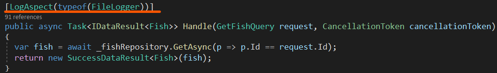
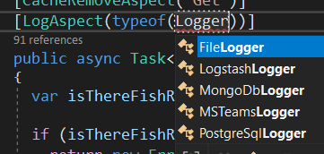
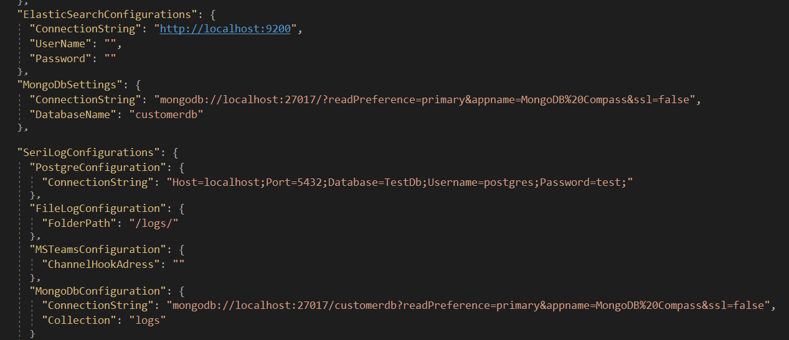

**LogAspect**'ler **Business -> Handlers -> <SınıfAdi>**  Command ve Query sınıflarında **Handle** metotları üzerinde **Attribute** olarak kullanılır. Kullanımı şekildeki gibidir.

**DevArchitecture** ile **LogAspect**; 
1. **FileLogger**
2. **PostgreSqlLogger**
3. **MongoDbLogger**
4. **LogstashLogger**
5. **MSTeamsLogger** desteğiyle gelir. Ön tanımlı olarak FileLogger kullanılır.

Kullanılacak olan log konfigürasyonu **WebAPI -> appsettings.json** içerisinde yapılmaktadır.

**author:** Kerem VARIŞ