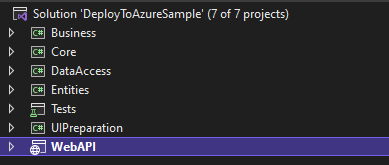
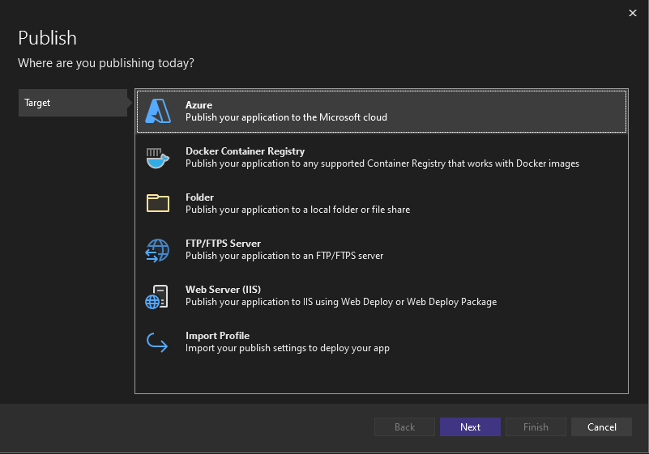
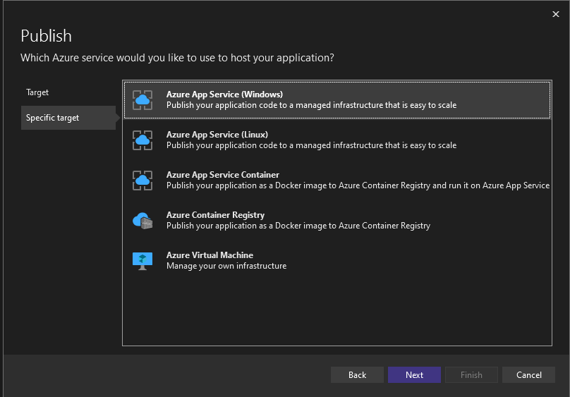
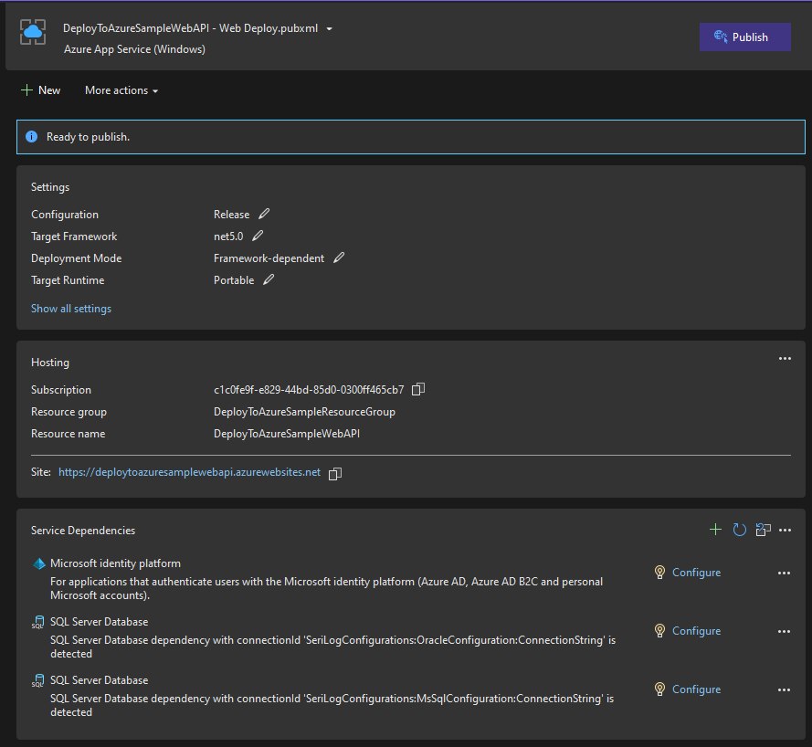
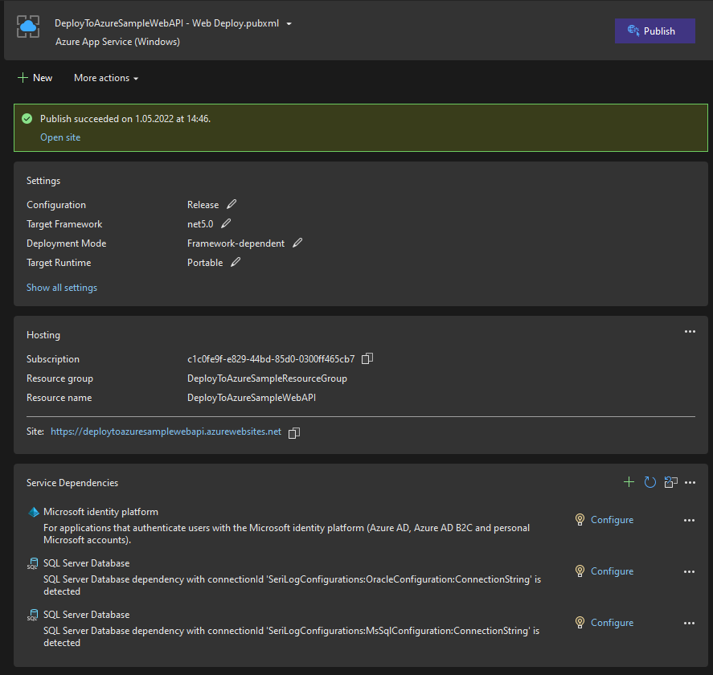
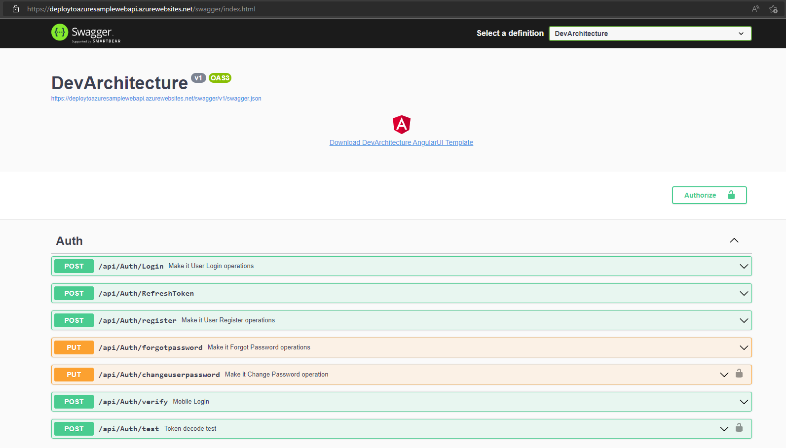

**Azure** üzerinde yayınlanacak olan proje ***Solution Explorer*** penceresinden seçilir ve sağ tıklanır.

**Publish..** butonuna tıklanır.

**Target** olarak **Azure** seçilir ve **Next** butonuna tıklanır.

**Spesific Target** olarak uygun bir seçenek seçilir ve **Next** butonuna tıklanır. Bu örnekte **Windows** seçilmiştir.

**App Service** oluşturmak için **Azure hesabı** gereklidir. **Azure hesabınız** yoksa bir tane oluşturunuz.

**App Service** oluşturmak için yeşil renkli **+** butonuna tıklanır.

Açılan sayfada 4 alanın doldurulması gerekmektedir. **Name** alanından App Service adı belirlenir. **Subscription name** alanından abonelik türü seçilir. **Resource group** alanı için **New..** butonuna tıklanarak bir kaynak grubu oluşturulur. **Hosting Plan** alanı için de **New..** butonuna tıklanarak bir hosting planı oluşturulur. Tüm alanlar doldurulduktan sonra **Create** butonuna tıklanır.

Oluşturmuş olduğunuz **App Service** seçildikten sonra **Next** butonuna tıklanır. 

 API yönetim platformu olan **API Management** kullanılmak isteniyorsa yeşil renkli **+** butonuna tıklanır ve oluşturulur. Bu örnekte kullanılmayacağı için **Skip this step** seçeneği seçilir ve **Finish** butonuna tıklanır.

Publish ekranında **Ready to publish** yazısı görünüyorsa **Publish** butonuna tıklanır. 

Publish yapıldıktan sonra **Open site** linkine tıklayarak sitenize gidebilirsiniz (API olduğu için sayfa bulunamayacaktır).

Uygulamanızın çalışır halini **Swagger** üzerinde test etmek için tarayıcınızın adres çubuğu yardımıyla http{s}://<<ALAN_ADI>>/swagger/index.html adresine gidebilirsiniz.

**author:** Veli GÖRGÜLÜ